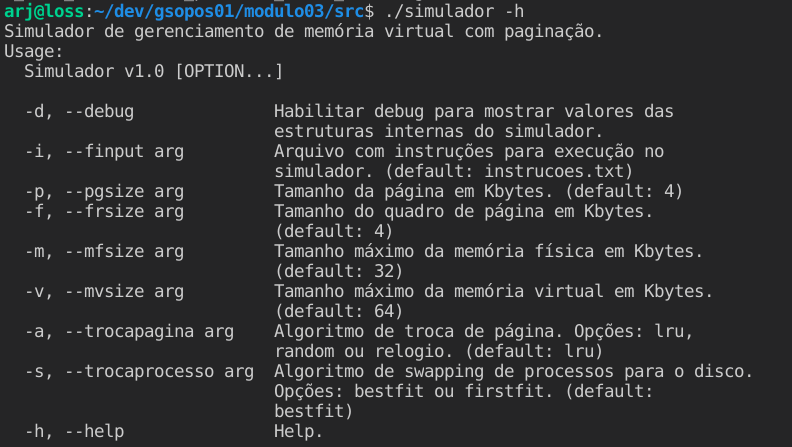
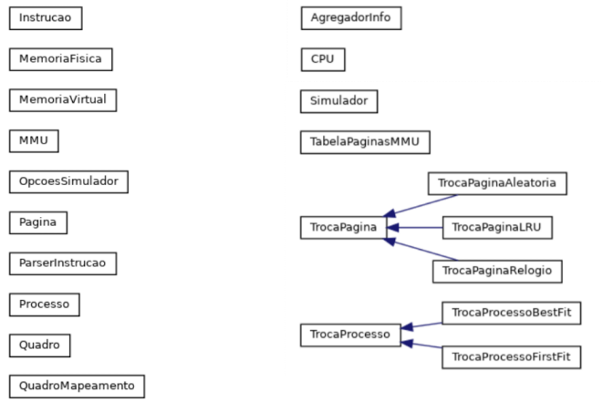

# Grupo 1 - Módulo 3 - SSC5723

[TOC]
## Integrantes

| Aluno(a)  | Número USP |
|----------------------| -------------|
| Aguimar Ribeiro Júnior | 11516281 |
| Fabíola Malta Fleury | 12501766 |
| Gabriel Souto Ferrante | 12620303 |

## Estrutura do Projeto

### Diretórios

| Diretório  | Descrição |
|----------------------| -------------|
| ./docs             | Documentações |
| ./src             | Códigos-fonte |

### Descrição dos Arquivos de Códigos-Fonte

| Arquivo | Descrição |
|----------------------| -------------|
| agregador_info.cc | Agregador de informações das estruturas de dados internas do simulador. |
| cpu.cc | Representação da CPU. |
| instrucao.cc | Representação de instrução e tipos de instruções aceitas pelo simulador. |
| main.cc | Arquivo que inicializa o simulador e trata as opções informadas na linha de comando. |
| memoria_fisica.cc | Representação da memória física. |
| memoria_virtual.cc | Representação da memória virtual. |
| mmu.cc | Representação da MMU - responsável pelo mapeamento entre memórias virtual e física. |
| opcoes_simulador.cc | Opções disponíveis para configuração do simulador. |
| parser_instrucao.cc | Parser de instruções. |
| processo.cc | Representação de processo e sua alocação de páginas. |
| simulador.cc | Implementação do simulador. |
| tabela_paginas_mmu.cc | Tabela de páginas utilizada pela MMU para mapeamento. |
| troca_pagina.h | Classe virtual como interface para implementação de algoritmos de troca de página. |
| troca_pagina_aleatoria.cc | Algoritmo de substituição de páginas de forma aleatória. |
| troca_pagina_lru.cc | Algoritmo LRU de substituição de páginas. |
| troca_pagina_relogio.cc | Algoritmo do Relógio de substituição de páginas. |
| troca_processo.h | Classe virtual como interface para implementação de swapping de processos para o disco. |
| troca_processo_first_fit.cc | Algoritmo First-fit para swapping de processo para o disco. |
| troca_processo_best_fit.cc | Algoritmo Best-fit para swapping de processo para o disco. |

### Compilação e Execução

1. Compilação do Simulador, no diretório *src*:

        make

2. Execução do programa:

        ./simulador

3. Para verificar quais as opções disponíveis na linha de comando:

        ./simulador -h

### Configurações via Linha de Comando

Foi desenvolvida a possibilidade de passar configurações para o programa via linha de comando, são elas:



### Principais Classes Do Simulador



#### Classe Instrucao

```cpp
// Tipos de instruções possíveis
enum class TipoInstrucao { C, R, W, P, I };

// Impressão do tipo de instrução
std::ostream &operator<<(std::ostream &os, const TipoInstrucao &tipo);

// Formato de uma instrução
struct Instrucao
{
    // Identificador do processo
    std::string processo;
    // Tipo de instrução
    TipoInstrucao tipo;
    // Tamanho/posição de memória
    std::string pos;
};
```

#### Classe ParserInstrucao

```cpp
class ParserInstrucao
{
public:
    // Recebe como entrada o arquivo contendo diversas instruções
    ParserInstrucao(const std::string arq_instrucoes);
    // Retornar as instruções após parsing do arquivo
    std::vector<Instrucao> get_instrucoes();
    // Total de instruções
    int total_instrucoes();
  ...
}
```

#### Classe MemoriaFisica

```cpp
class MemoriaFisica
{

public:
	// Inicializar memória física especificando o tamanho da memória em kbytes e a quantidade de quadros
	MemoriaFisica(int tam_mem, int tam_quadro);
	// Tamanho do quadro em kbytes
	int tamanho_quadro;
	// Quantidade de quadros
	int num_quadros;
	// Ler posição de memória indicada por addr
	void ler_endereco(int addr);
	// Escrever posição de memória indicada por addr
	void escrita_endereco(int addr);

private:
	// Tamanho da memória física em kbytes
	int tamanho;
	// Espaço de endereçamento físico
	std::vector<Quadro> espaco_enderecamento;
};
```
#### Classe Quadro

```cpp
class Quadro
{

public:
	// Especificar o tamanho do quadro em kbytes
	Quadro(int tam);

private:
	// Tamanho do quadro em bytes
	int tamanho;
};
```

#### Classe MemoriaVirtual

```cpp
class MemoriaVirtual
{
public:
    // Especificar o tamanho da memória virtual em kbytes e o número de páginas
    MemoriaVirtual(int tam_mem, int tam_pagina);
    // Alocar n_paginas
    int alocar(int n_paginas);
    // Quantidade de páginas
    int num_paginas;
    // Tamanho da página em kbytes
    int tamanho_pagina;
     // Quantidade de páginas livres
    int total_paginas_livres();
    // Espaço de endereçamento virtual
    std::vector<Pagina> espaco_enderecamento;
    // Procura por n páginas sequenciais livres na memória e retorna o número da inicial.
    int procurar_n_paginas_sequenciais_livres(int n);

private:
    // Tamanho da memória virtual em kbytes
    int tamanho;

    // Consolidar alocação de memória
    void consolidar_alocacao(int n, int pagina_inicial);
    // Verificar se existem n páginas livres
    bool existe_n_paginas_livres(int n);
};

```

#### Classe Pagina

```cpp
class Pagina
{

public:
    // Especifica o tamanho da página em kbytes
    Pagina(int tam);
    // Página alocada para um processo?
    bool alocada = false;
    // Página modificada/suja (dirty)?
    bool modificada = false;
    // Página foi referenciada?
    bool referenciada = false;
    // Qual a última instrução que fez referência a esta página?
    int ultima_referencia = 0;

private:
    // Tamanho da página em kbytes
    int tamanho;
};
```

#### Classe MMU

```cpp
class MMU
{
public:
    // Inicializa MMU com apontamentos para a memória física, virtual e o algoritmo de substituição de páginas escolhido
    MMU(MemoriaFisica *mfisica, MemoriaVirtual *mvirtual, TrocaPagina *sub_pagina);
    // Destrutor
    ~MMU();
    // Ler endereço de memória virtual requisitado pelo processo especificado
    void ler_endereco(int addr, Processo *proc, int contador_instrucao);
    // Gravar endereço de memória virtual requisitado pelo processo especificado
    void gravar_no_endereco(int addr, Processo *proc, int contador_instrucao);
    // Atualizar lista de páginas presentes
    void atualizar_lista_paginas_presentes();
    // Alocar n_paginas_necessarias. Retorna uma lista com os números das páginas alocadas
    std::vector<int> *alocar(int n_paginas_necessarias);
    // Verifica necessidade de compactação
    bool check_necessidade_compactacao(int n_paginas);
    // Realizar compactação de memória. As páginas livres são reposicionadas para o início do espaço de endereçamento.
    std::map<int, int> compactacao();
    // Apontador para a memória virtual
    MemoriaVirtual *mem_virtual;

private:
    // Contador de falhas de página (pages fault)
    int page_fault_counter = 0;
    // Apontador para a memória física
    MemoriaFisica *mem_fisica;
    // Tabela contendo o mapeamento entre páginas e frames
    TabelaPaginasMMU *tb_paginas;
    // Algoritmo de substituição de páginas
    TrocaPagina *subst_pagina;
    // Tabela de páginas presentes
    std::map<int, Pagina &> paginas_presentes;
    // Verificar se o acesso à página requisitado pelo processo é válido
    bool check_acesso_valido_processo(Processo *proc, int num_pagina);
    // Verificar se a página de número pg está presente
    bool check_pagina_presente(int pg);
    // Ler endereço físico addr
    void ler_endereco_fisico(int addr);
    // Escrever no endereço addr
    void escrita_endereco_fisico(int addr);
    // Rotina responsável pelo tratamento de page fault (falha de página)
    void tratar_page_fault(int pg);
    // Retornar o número do próximo quadro livre, se disponível
    int get_quadro_livre();
    // Salvar página número num_pagina no disco
    void salvar_pagina_no_disco(int num_pagina);

    // Permitir que a classe AgregadorInfo tenha acesso às instruturas internas na MMU
    friend class AgregadorInfo;
};
```

#### Classe TabelaPaginasMMU

```cpp
class TabelaPaginasMMU
{
public:
    // Inicializa tabela para mapeamento entre páginas e quadros
    TabelaPaginasMMU(int num_paginas, int num_quadros);
    // Retonar o número do quadro apontado pela página número num_pagina
    int get_quadro(int num_pagina);
    // Mapear a página número num_pagina para o quadro número num_quadro
    void mapear(int num_pagina, int num_quadro);
    // Desfazer o mapeamento da página
    void desmapear(int num_pagina);
    // Recriar a tabela de mapeamento
    void remapear(std::map<int, int> novo_mapeamento);
    // Retornar o número de páginas presentes na memória
    std::vector<int> get_numeros_paginas_presentes();
    // Mapeamento entre número de página e QuadroMapeamento (número do quadro e se está presente ou não na memória)
    std::map<int, QuadroMapeamento> mapeamento;

private:
    // Quantidade de páginas
    int n_paginas;
    // Quantidade de quadros
    int n_quadros;

    // Inicializar o mapeamento
    void criar(void);
};
```

#### Classe QuadroMapeamento

```cpp
typedef struct QuadroMapeamento
{
  // Número do quadro
    int numero_quadro;
  // Flag que controla se o quadro está presente.
    bool presente;
} QuadroMapeamento;
```

#### Classe CPU

```cpp
class CPU
{
public:
    // Inicializar CPU com apontamentos para a MMU e para o algoritmo de swapping escolhido.
    CPU(MMU *mmu, TrocaProcesso *s);
    // Destrutor
    ~CPU();
    // Executar instrução cmd informada.
    void executar_instrucao(const Instrucao &cmd);

private:
    // Apontamento para a MMU
    MMU *mmu;
    // Algoritmo de swapping de processos para disco
    TrocaProcesso *swapper;
    // Tabela de processos
    std::vector<Processo *> tb_processos;
    // Instrução atual em/para execução
    Instrucao instrucao_atual;
    // Número da instrução atual
    int contador_instrucao = 0;
    // Pesquisar por processo com identificador id na tabela de processos
    Processo *pesquisar_tabela_processos(std::string id);

    // Criar novo processo
    void criar_processo();
    // Executar instrução de CPU
    void executar_instrucao_cpu();
    // Executar instrução de IO
    void executar_instrucao_io();
    // Executar instrução de leitura
    void executar_leitura();
    // Executar instrução de escrita
    void executar_escrita();
    // Verificar se o processo id está na memória
    bool processo_em_memoria(std::string id);
    // Alocar processo na memória
    void alocar_processo_na_memoria(Processo *proc);
    // Parsing do endereço binário informado na instrução
    int parse_endereco(std::string addr);
    // Executar a instrução de CPU lida do endereço addr_instrucao
    void executar_instrucao_cpu_lida(int addr_instrucao);
    // Executar a instrução de IO lida do endereço addr_instrucao
    void executar_instrucao_io_lida(int addr_instrucao);
    // Corrigir tabela de páginas dos processos de acordo com o novo enderecamento informado
    void corrigir_tabela_paginas_processos(std::map<int, int> novo_enderecamento);

    // Permitir que a classe AgregadorInfo tenha acesso às instruturas internas na MMU
    friend class AgregadorInfo;
};
```

#### Classe Processo

```cpp
class Processo
{
public:
    // Novo processo id com estado, quantidade de memória necessária em kbytes e número mínimo de páginas para alocação
    Processo(std::string id, std::string estado, int alloc, int n_min_paginas);
    // Mantem os números das páginas alocadas para o processo
    paginas_alocadas tb_paginas;
    // Troca o estado do processo
    void trocar_estado(std::string e);
    // Retorna o estado atual do processo
    std::string get_estado_atual();
    // Configurar a tabela de páginas do processo
    void set_tabela_paginas(paginas_alocadas tb);
    // Retornar o número da página base associada ao processo
    int get_pagina_base();
    // Indica se o processo está em disco (causado pelo swapper)
    bool em_disco = true;
    // Alocação mínima necessária em kbytes
    int alocacao_minima;
    // Quantidade mínima de páginas necessárias
    int qtde_minima_paginas;
    // Identificador do processo
    std::string id;
    // Estado do processo - novo, pronto, suspenso, executando, bloqueado
    std::string estado;
};
```

#### Classe TrocaPagina

```cpp
class TrocaPagina
{
public:
    // Destrutor virtual para herança
    virtual ~TrocaPagina(){};
    // Método run a ser implementado pelas classes de algoritmos de substituição de páginas
    virtual int run(std::map<int, Pagina&> paginas_presentes) = 0;
};
```

#### Classe TrocaPaginaAleatoria

```cpp
// Algoritmo de substituição de páginas de forma aleatória
// Subclasse de TrocaPagina
class TrocaPaginaAleatoria : public TrocaPagina
{
public:
    // Método sobrescrito
    int run(std::map<int, Pagina&> paginas_presentes) override;
};
```

#### Classe TrocaPaginaLRU

```cpp
// Algoritmo LRU para substituição de páginas
// Subclasse de TrocaPagina
class TrocaPaginaLRU : public TrocaPagina
{
public:
    // Método sobrescrito
    int run(std::map<int, Pagina&> paginas_presentes) override;
};
```

#### Classe TrocaPaginaRelogio

```cpp
// Algoritmo do Relógio para substituição de páginas
// Subclasse de TrocaPagina
class TrocaPaginaRelogio : public TrocaPagina
{
public:
    // Método sobrescrito
    int run(std::map<int, Pagina&> paginas_presentes) override;
    // Recuperar o número da página para qual o ponteiro do relógio está apontando
    int recuperar_ponteiro_relogio();
    // Ajustar o ponteiro do relógio para a próxima posição
    void ajustar_ponteiro_relogio(int nova_posicao);

private:
    // Ponteiro do relógio
    int ponteiro_relogio = 0;
    // Avançar o ponteiro do relógio. Dependente da quantidade de páginas que existem.
    void avancar_ponteiro(int qtde_de_paginas);
};
```

#### Classe TrocaProcesso

```cpp
class TrocaProcesso
{
public:
    // Destrutor virtual para herança
    virtual ~TrocaProcesso(){};
    // Método run a ser implementado pelas classes de algoritmos de swapping de processos para o disco
    virtual void run(std::vector<Processo *> &tb_processos, std::vector<Pagina> &espaco_enderecamento, int n_vitimas) = 0;
    // Método de swap-in a ser implementado pelas classes classes de algoritmos de swapping de processos para o disco
    virtual void swap_in(Processo *proc) = 0;
};
```

#### Classe TrocaProcessoFirstFit

```cpp
// Retirar o primeiro processo com o número de páginas vítimas necessárias que encontrar
// Subclasse de TrocaProcesso
class TrocaProcessoFirstFit : public TrocaProcesso
{
public:
    // Método sobrescrito
    void run(std::vector<Processo *> &tb_processos, std::vector<Pagina> &espaco_enderecamento, int n_vitimas) override;
...
};
```

#### Classe TrocaProcessoBestFit

```cpp
// Retirar o processo que ocupe menos espaço e que atenda o número de páginas vítimas necessárias
// Subclasse de TrocaProcesso
class TrocaProcessoBestFit : public TrocaProcesso
{
public:
    // Método sobrescrito
    void run(std::vector<Processo *> &tb_processos, std::vector<Pagina> &espaco_enderecamento, int n_vitimas) override;
...
};
```

#### Classe Simulador

```cpp
class Simulador
{

public:
    ...
    // Inicializa o simulador com as opções de linha de comando e lista de instruções a serem executadas.
    Simulador(OpcoesSimulador *opcoes, std::vector<Instrucao> cmds);
    // Executar todas as instruções
    void executar();
    // Executar a instrução atual apontada pelo contador de instruções
    void executar_1_passo();
    // Encerrar a simulação
    void finalizar();

private:
    // Opções do simulador
    OpcoesSimulador *opcoes;
    // Lista de instruções
    std::vector<Instrucao> cmds;
    // Ponteiro para a CPU
    CPU* cpu;
    // Ponteiro para a MMU
    MMU* mmu;
    // Ponteiro para a memória física
    MemoriaFisica* mem_fisica;
    // Ponteiro para a memória virtual
    MemoriaVirtual* mem_virtual;
    // Consolidador de informações estatístiscas das estruturas de dados internas
    AgregadorInfo* info;
    // Contador de instruções
    int contador_instrucao = 0;
    // Flag de debug
    bool debug = false;
};
```
#### Classe OpcoesSimulador

```cpp
// Estrutura de dados para guardar as opções possíveis de linha de comando para o simulador
struct OpcoesSimulador
{
    // Nome do arquivo de instruções
    std::string finput;
    // Tamanhos da(o): página, frame, memória física, memória principal
    int pgsize, frsize, mfsize, mvsize, iprsize;
    // Algoritmo de substituição de páginas escolhido
    TrocaPagina *substituicao_pagina;
    // Algoritmo de swapping de processo para o disco escolhido
    TrocaProcesso *swapper;
    // Habilitação de modo debug para mostrar valores das estruturas de dados internas do simulador
    bool debug;

    // Método responsável por tratar as opções informadas na linha de comando e preencher a struct OpcoesSimulador
    static OpcoesSimulador *tratarOpcoes(int argc, char **argv);
};
```

## Exemplos de Entradas e Saídas em Modo Debug

Os exemplos a seguir utilizam as opções default do simulador, exceto pelo nome do arquivo de instruções de entrada e o modo debug ativo. Todos os arquivos utilizados nos exemplos abaixo e suas respectivas saídas estão disponíveis no diretório *docs/exemplos* do projeto. No modo debug, após a execução de cada instrução, são mostrados os valores das instruturas internas do simulador.

```bash
./simulador -d -i entrada.txt > saida.log
```

### Exemplo 1: Novo Processo

#### Entrada (*docs/exemplo1_entrada.txt*)
<pre>
P1 C 50
</pre>

#### Saída
<pre>
##### SIMULAÇÃO - INÍCIO #####

[Criando Processo P1]

*** DEBUG - INÍCIO ***

### CPU - Contador de instrução: 1 ###

### CPU - Última instrução executada ###

 - Processo: P1
 - Tipo: Novo Processo
 - Endereço/Tamanho: 50

### CPU - Tabela de processos ###

 - ID: P1 - Estado: PRONTO - Em disco: 0 - Páginas Alocadas: 0 1 2 3 4 5 6 7 8 9 10 11 12 

### Memória Virtual - Espaço de Endereçamento ###

Página nº.: 0
Alocada: 1 - Modificada: 0 - Referenciada: 0
Última referência na instrução nº.: 0

Página nº.: 1
Alocada: 1 - Modificada: 0 - Referenciada: 0
Última referência na instrução nº.: 0

Página nº.: 2
Alocada: 1 - Modificada: 0 - Referenciada: 0
Última referência na instrução nº.: 0

Página nº.: 3
Alocada: 1 - Modificada: 0 - Referenciada: 0
Última referência na instrução nº.: 0

Página nº.: 4
Alocada: 1 - Modificada: 0 - Referenciada: 0
Última referência na instrução nº.: 0

Página nº.: 5
Alocada: 1 - Modificada: 0 - Referenciada: 0
Última referência na instrução nº.: 0

Página nº.: 6
Alocada: 1 - Modificada: 0 - Referenciada: 0
Última referência na instrução nº.: 0

Página nº.: 7
Alocada: 1 - Modificada: 0 - Referenciada: 0
Última referência na instrução nº.: 0

Página nº.: 8
Alocada: 1 - Modificada: 0 - Referenciada: 0
Última referência na instrução nº.: 0

Página nº.: 9
Alocada: 1 - Modificada: 0 - Referenciada: 0
Última referência na instrução nº.: 0

Página nº.: 10
Alocada: 1 - Modificada: 0 - Referenciada: 0
Última referência na instrução nº.: 0

Página nº.: 11
Alocada: 1 - Modificada: 0 - Referenciada: 0
Última referência na instrução nº.: 0

Página nº.: 12
Alocada: 1 - Modificada: 0 - Referenciada: 0
Última referência na instrução nº.: 0

Página nº.: 13
Alocada: 0 - Modificada: 0 - Referenciada: 0
Última referência na instrução nº.: 0

Página nº.: 14
Alocada: 0 - Modificada: 0 - Referenciada: 0
Última referência na instrução nº.: 0

Página nº.: 15
Alocada: 0 - Modificada: 0 - Referenciada: 0
Última referência na instrução nº.: 0

### MMU - Mapeamento entre Páginas e Quadros ###

Página nº.: 0 - Quadro nº.: -1 - Presente: 0
Página nº.: 1 - Quadro nº.: -1 - Presente: 0
Página nº.: 2 - Quadro nº.: -1 - Presente: 0
Página nº.: 3 - Quadro nº.: -1 - Presente: 0
Página nº.: 4 - Quadro nº.: -1 - Presente: 0
Página nº.: 5 - Quadro nº.: -1 - Presente: 0
Página nº.: 6 - Quadro nº.: -1 - Presente: 0
Página nº.: 7 - Quadro nº.: -1 - Presente: 0
Página nº.: 8 - Quadro nº.: -1 - Presente: 0
Página nº.: 9 - Quadro nº.: -1 - Presente: 0
Página nº.: 10 - Quadro nº.: -1 - Presente: 0
Página nº.: 11 - Quadro nº.: -1 - Presente: 0
Página nº.: 12 - Quadro nº.: -1 - Presente: 0
Página nº.: 13 - Quadro nº.: -1 - Presente: 0
Página nº.: 14 - Quadro nº.: -1 - Presente: 0
Página nº.: 15 - Quadro nº.: -1 - Presente: 0

### MMU - Contador de page faults: 0 ###

*** DEBUG - FIM ***

##### SIMULAÇÃO - FIM #####
</pre>


### Exemplo 2: Leitura de Posição de Memória

#### Entrada (*docs/exemplo2_entrada.txt*)
<pre>
P1 C 50
P1 R (0)2
</pre>

#### Saída
<pre>
##### SIMULAÇÃO - INÍCIO #####

[Criando Processo P1]

*** DEBUG - INÍCIO ***

### CPU - Contador de instrução: 1 ###

### CPU - Última instrução executada ###

 - Processo: P1
 - Tipo: Novo Processo
 - Endereço/Tamanho: 50

### CPU - Tabela de processos ###

 - ID: P1 - Estado: PRONTO - Em disco: 0 - Páginas Alocadas: 0 1 2 3 4 5 6 7 8 9 10 11 12 

### Memória Virtual - Espaço de Endereçamento ###

Página nº.: 0
Alocada: 1 - Modificada: 0 - Referenciada: 0
Última referência na instrução nº.: 0

Página nº.: 1
Alocada: 1 - Modificada: 0 - Referenciada: 0
Última referência na instrução nº.: 0

Página nº.: 2
Alocada: 1 - Modificada: 0 - Referenciada: 0
Última referência na instrução nº.: 0

Página nº.: 3
Alocada: 1 - Modificada: 0 - Referenciada: 0
Última referência na instrução nº.: 0

Página nº.: 4
Alocada: 1 - Modificada: 0 - Referenciada: 0
Última referência na instrução nº.: 0

Página nº.: 5
Alocada: 1 - Modificada: 0 - Referenciada: 0
Última referência na instrução nº.: 0

Página nº.: 6
Alocada: 1 - Modificada: 0 - Referenciada: 0
Última referência na instrução nº.: 0

Página nº.: 7
Alocada: 1 - Modificada: 0 - Referenciada: 0
Última referência na instrução nº.: 0

Página nº.: 8
Alocada: 1 - Modificada: 0 - Referenciada: 0
Última referência na instrução nº.: 0

Página nº.: 9
Alocada: 1 - Modificada: 0 - Referenciada: 0
Última referência na instrução nº.: 0

Página nº.: 10
Alocada: 1 - Modificada: 0 - Referenciada: 0
Última referência na instrução nº.: 0

Página nº.: 11
Alocada: 1 - Modificada: 0 - Referenciada: 0
Última referência na instrução nº.: 0

Página nº.: 12
Alocada: 1 - Modificada: 0 - Referenciada: 0
Última referência na instrução nº.: 0

Página nº.: 13
Alocada: 0 - Modificada: 0 - Referenciada: 0
Última referência na instrução nº.: 0

Página nº.: 14
Alocada: 0 - Modificada: 0 - Referenciada: 0
Última referência na instrução nº.: 0

Página nº.: 15
Alocada: 0 - Modificada: 0 - Referenciada: 0
Última referência na instrução nº.: 0

### MMU - Mapeamento entre Páginas e Quadros ###

Página nº.: 0 - Quadro nº.: -1 - Presente: 0
Página nº.: 1 - Quadro nº.: -1 - Presente: 0
Página nº.: 2 - Quadro nº.: -1 - Presente: 0
Página nº.: 3 - Quadro nº.: -1 - Presente: 0
Página nº.: 4 - Quadro nº.: -1 - Presente: 0
Página nº.: 5 - Quadro nº.: -1 - Presente: 0
Página nº.: 6 - Quadro nº.: -1 - Presente: 0
Página nº.: 7 - Quadro nº.: -1 - Presente: 0
Página nº.: 8 - Quadro nº.: -1 - Presente: 0
Página nº.: 9 - Quadro nº.: -1 - Presente: 0
Página nº.: 10 - Quadro nº.: -1 - Presente: 0
Página nº.: 11 - Quadro nº.: -1 - Presente: 0
Página nº.: 12 - Quadro nº.: -1 - Presente: 0
Página nº.: 13 - Quadro nº.: -1 - Presente: 0
Página nº.: 14 - Quadro nº.: -1 - Presente: 0
Página nº.: 15 - Quadro nº.: -1 - Presente: 0

### MMU - Contador de page faults: 0 ###

*** DEBUG - FIM ***

[P1] Leitura
PAGE FAULT. Chamando rotina de tratamento.
Mapeamento de endereço - Virtual: 0 Físico: 0
Leitura de memória física realizada. Endereço: 0

*** DEBUG - INÍCIO ***

### CPU - Contador de instrução: 2 ###

### CPU - Última instrução executada ###

 - Processo: P1
 - Tipo: Leitura
 - Endereço/Tamanho: (0)2

### CPU - Tabela de processos ###

 - ID: P1 - Estado: PRONTO - Em disco: 0 - Páginas Alocadas: 0 1 2 3 4 5 6 7 8 9 10 11 12 

### Memória Virtual - Espaço de Endereçamento ###

Página nº.: 0
Alocada: 1 - Modificada: 0 - Referenciada: 1
Última referência na instrução nº.: 1

Página nº.: 1
Alocada: 1 - Modificada: 0 - Referenciada: 0
Última referência na instrução nº.: 0

Página nº.: 2
Alocada: 1 - Modificada: 0 - Referenciada: 0
Última referência na instrução nº.: 0

Página nº.: 3
Alocada: 1 - Modificada: 0 - Referenciada: 0
Última referência na instrução nº.: 0

Página nº.: 4
Alocada: 1 - Modificada: 0 - Referenciada: 0
Última referência na instrução nº.: 0

Página nº.: 5
Alocada: 1 - Modificada: 0 - Referenciada: 0
Última referência na instrução nº.: 0

Página nº.: 6
Alocada: 1 - Modificada: 0 - Referenciada: 0
Última referência na instrução nº.: 0

Página nº.: 7
Alocada: 1 - Modificada: 0 - Referenciada: 0
Última referência na instrução nº.: 0

Página nº.: 8
Alocada: 1 - Modificada: 0 - Referenciada: 0
Última referência na instrução nº.: 0

Página nº.: 9
Alocada: 1 - Modificada: 0 - Referenciada: 0
Última referência na instrução nº.: 0

Página nº.: 10
Alocada: 1 - Modificada: 0 - Referenciada: 0
Última referência na instrução nº.: 0

Página nº.: 11
Alocada: 1 - Modificada: 0 - Referenciada: 0
Última referência na instrução nº.: 0

Página nº.: 12
Alocada: 1 - Modificada: 0 - Referenciada: 0
Última referência na instrução nº.: 0

Página nº.: 13
Alocada: 0 - Modificada: 0 - Referenciada: 0
Última referência na instrução nº.: 0

Página nº.: 14
Alocada: 0 - Modificada: 0 - Referenciada: 0
Última referência na instrução nº.: 0

Página nº.: 15
Alocada: 0 - Modificada: 0 - Referenciada: 0
Última referência na instrução nº.: 0

### MMU - Mapeamento entre Páginas e Quadros ###

Página nº.: 0 - Quadro nº.: 0 - Presente: 1
Página nº.: 1 - Quadro nº.: -1 - Presente: 0
Página nº.: 2 - Quadro nº.: -1 - Presente: 0
Página nº.: 3 - Quadro nº.: -1 - Presente: 0
Página nº.: 4 - Quadro nº.: -1 - Presente: 0
Página nº.: 5 - Quadro nº.: -1 - Presente: 0
Página nº.: 6 - Quadro nº.: -1 - Presente: 0
Página nº.: 7 - Quadro nº.: -1 - Presente: 0
Página nº.: 8 - Quadro nº.: -1 - Presente: 0
Página nº.: 9 - Quadro nº.: -1 - Presente: 0
Página nº.: 10 - Quadro nº.: -1 - Presente: 0
Página nº.: 11 - Quadro nº.: -1 - Presente: 0
Página nº.: 12 - Quadro nº.: -1 - Presente: 0
Página nº.: 13 - Quadro nº.: -1 - Presente: 0
Página nº.: 14 - Quadro nº.: -1 - Presente: 0
Página nº.: 15 - Quadro nº.: -1 - Presente: 0

### MMU - Contador de page faults: 1 ###

*** DEBUG - FIM ***

##### SIMULAÇÃO - FIM #####
</pre>


### Exemplo 3: Leitura e Escrita de Posição de Memória

#### Entrada (*docs/exemplo3_entrada.txt*)
<pre>
P1 C 50
P1 R (0)2
P1 W (0)2
</pre>

#### Saída
<pre>
##### SIMULAÇÃO - INÍCIO #####

[Criando Processo P1]

*** DEBUG - INÍCIO ***

### CPU - Contador de instrução: 1 ###

### CPU - Última instrução executada ###

 - Processo: P1
 - Tipo: Novo Processo
 - Endereço/Tamanho: 50

### CPU - Tabela de processos ###

 - ID: P1 - Estado: PRONTO - Em disco: 0 - Páginas Alocadas: 0 1 2 3 4 5 6 7 8 9 10 11 12 

### Memória Virtual - Espaço de Endereçamento ###

Página nº.: 0
Alocada: 1 - Modificada: 0 - Referenciada: 0
Última referência na instrução nº.: 0

Página nº.: 1
Alocada: 1 - Modificada: 0 - Referenciada: 0
Última referência na instrução nº.: 0

Página nº.: 2
Alocada: 1 - Modificada: 0 - Referenciada: 0
Última referência na instrução nº.: 0

Página nº.: 3
Alocada: 1 - Modificada: 0 - Referenciada: 0
Última referência na instrução nº.: 0

Página nº.: 4
Alocada: 1 - Modificada: 0 - Referenciada: 0
Última referência na instrução nº.: 0

Página nº.: 5
Alocada: 1 - Modificada: 0 - Referenciada: 0
Última referência na instrução nº.: 0

Página nº.: 6
Alocada: 1 - Modificada: 0 - Referenciada: 0
Última referência na instrução nº.: 0

Página nº.: 7
Alocada: 1 - Modificada: 0 - Referenciada: 0
Última referência na instrução nº.: 0

Página nº.: 8
Alocada: 1 - Modificada: 0 - Referenciada: 0
Última referência na instrução nº.: 0

Página nº.: 9
Alocada: 1 - Modificada: 0 - Referenciada: 0
Última referência na instrução nº.: 0

Página nº.: 10
Alocada: 1 - Modificada: 0 - Referenciada: 0
Última referência na instrução nº.: 0

Página nº.: 11
Alocada: 1 - Modificada: 0 - Referenciada: 0
Última referência na instrução nº.: 0

Página nº.: 12
Alocada: 1 - Modificada: 0 - Referenciada: 0
Última referência na instrução nº.: 0

Página nº.: 13
Alocada: 0 - Modificada: 0 - Referenciada: 0
Última referência na instrução nº.: 0

Página nº.: 14
Alocada: 0 - Modificada: 0 - Referenciada: 0
Última referência na instrução nº.: 0

Página nº.: 15
Alocada: 0 - Modificada: 0 - Referenciada: 0
Última referência na instrução nº.: 0

### MMU - Mapeamento entre Páginas e Quadros ###

Página nº.: 0 - Quadro nº.: -1 - Presente: 0
Página nº.: 1 - Quadro nº.: -1 - Presente: 0
Página nº.: 2 - Quadro nº.: -1 - Presente: 0
Página nº.: 3 - Quadro nº.: -1 - Presente: 0
Página nº.: 4 - Quadro nº.: -1 - Presente: 0
Página nº.: 5 - Quadro nº.: -1 - Presente: 0
Página nº.: 6 - Quadro nº.: -1 - Presente: 0
Página nº.: 7 - Quadro nº.: -1 - Presente: 0
Página nº.: 8 - Quadro nº.: -1 - Presente: 0
Página nº.: 9 - Quadro nº.: -1 - Presente: 0
Página nº.: 10 - Quadro nº.: -1 - Presente: 0
Página nº.: 11 - Quadro nº.: -1 - Presente: 0
Página nº.: 12 - Quadro nº.: -1 - Presente: 0
Página nº.: 13 - Quadro nº.: -1 - Presente: 0
Página nº.: 14 - Quadro nº.: -1 - Presente: 0
Página nº.: 15 - Quadro nº.: -1 - Presente: 0

### MMU - Contador de page faults: 0 ###

*** DEBUG - FIM ***

[P1] Leitura
PAGE FAULT. Chamando rotina de tratamento.
Mapeamento de endereço - Virtual: 0 Físico: 0
Leitura de memória física realizada. Endereço: 0

*** DEBUG - INÍCIO ***

### CPU - Contador de instrução: 2 ###

### CPU - Última instrução executada ###

 - Processo: P1
 - Tipo: Leitura
 - Endereço/Tamanho: (0)2

### CPU - Tabela de processos ###

 - ID: P1 - Estado: PRONTO - Em disco: 0 - Páginas Alocadas: 0 1 2 3 4 5 6 7 8 9 10 11 12 

### Memória Virtual - Espaço de Endereçamento ###

Página nº.: 0
Alocada: 1 - Modificada: 0 - Referenciada: 1
Última referência na instrução nº.: 1

Página nº.: 1
Alocada: 1 - Modificada: 0 - Referenciada: 0
Última referência na instrução nº.: 0

Página nº.: 2
Alocada: 1 - Modificada: 0 - Referenciada: 0
Última referência na instrução nº.: 0

Página nº.: 3
Alocada: 1 - Modificada: 0 - Referenciada: 0
Última referência na instrução nº.: 0

Página nº.: 4
Alocada: 1 - Modificada: 0 - Referenciada: 0
Última referência na instrução nº.: 0

Página nº.: 5
Alocada: 1 - Modificada: 0 - Referenciada: 0
Última referência na instrução nº.: 0

Página nº.: 6
Alocada: 1 - Modificada: 0 - Referenciada: 0
Última referência na instrução nº.: 0

Página nº.: 7
Alocada: 1 - Modificada: 0 - Referenciada: 0
Última referência na instrução nº.: 0

Página nº.: 8
Alocada: 1 - Modificada: 0 - Referenciada: 0
Última referência na instrução nº.: 0

Página nº.: 9
Alocada: 1 - Modificada: 0 - Referenciada: 0
Última referência na instrução nº.: 0

Página nº.: 10
Alocada: 1 - Modificada: 0 - Referenciada: 0
Última referência na instrução nº.: 0

Página nº.: 11
Alocada: 1 - Modificada: 0 - Referenciada: 0
Última referência na instrução nº.: 0

Página nº.: 12
Alocada: 1 - Modificada: 0 - Referenciada: 0
Última referência na instrução nº.: 0

Página nº.: 13
Alocada: 0 - Modificada: 0 - Referenciada: 0
Última referência na instrução nº.: 0

Página nº.: 14
Alocada: 0 - Modificada: 0 - Referenciada: 0
Última referência na instrução nº.: 0

Página nº.: 15
Alocada: 0 - Modificada: 0 - Referenciada: 0
Última referência na instrução nº.: 0

### MMU - Mapeamento entre Páginas e Quadros ###

Página nº.: 0 - Quadro nº.: 0 - Presente: 1
Página nº.: 1 - Quadro nº.: -1 - Presente: 0
Página nº.: 2 - Quadro nº.: -1 - Presente: 0
Página nº.: 3 - Quadro nº.: -1 - Presente: 0
Página nº.: 4 - Quadro nº.: -1 - Presente: 0
Página nº.: 5 - Quadro nº.: -1 - Presente: 0
Página nº.: 6 - Quadro nº.: -1 - Presente: 0
Página nº.: 7 - Quadro nº.: -1 - Presente: 0
Página nº.: 8 - Quadro nº.: -1 - Presente: 0
Página nº.: 9 - Quadro nº.: -1 - Presente: 0
Página nº.: 10 - Quadro nº.: -1 - Presente: 0
Página nº.: 11 - Quadro nº.: -1 - Presente: 0
Página nº.: 12 - Quadro nº.: -1 - Presente: 0
Página nº.: 13 - Quadro nº.: -1 - Presente: 0
Página nº.: 14 - Quadro nº.: -1 - Presente: 0
Página nº.: 15 - Quadro nº.: -1 - Presente: 0

### MMU - Contador de page faults: 1 ###

*** DEBUG - FIM ***

[P1] Escrita
Mapeamento de endereço - Virtual: 0 Físico: 0
Escrita na memória física realizada. Endereço: 0

*** DEBUG - INÍCIO ***

### CPU - Contador de instrução: 3 ###

### CPU - Última instrução executada ###

 - Processo: P1
 - Tipo: Gravação
 - Endereço/Tamanho: (0)2

### CPU - Tabela de processos ###

 - ID: P1 - Estado: PRONTO - Em disco: 0 - Páginas Alocadas: 0 1 2 3 4 5 6 7 8 9 10 11 12 

### Memória Virtual - Espaço de Endereçamento ###

Página nº.: 0
Alocada: 1 - Modificada: 1 - Referenciada: 1
Última referência na instrução nº.: 2

Página nº.: 1
Alocada: 1 - Modificada: 0 - Referenciada: 0
Última referência na instrução nº.: 0

Página nº.: 2
Alocada: 1 - Modificada: 0 - Referenciada: 0
Última referência na instrução nº.: 0

Página nº.: 3
Alocada: 1 - Modificada: 0 - Referenciada: 0
Última referência na instrução nº.: 0

Página nº.: 4
Alocada: 1 - Modificada: 0 - Referenciada: 0
Última referência na instrução nº.: 0

Página nº.: 5
Alocada: 1 - Modificada: 0 - Referenciada: 0
Última referência na instrução nº.: 0

Página nº.: 6
Alocada: 1 - Modificada: 0 - Referenciada: 0
Última referência na instrução nº.: 0

Página nº.: 7
Alocada: 1 - Modificada: 0 - Referenciada: 0
Última referência na instrução nº.: 0

Página nº.: 8
Alocada: 1 - Modificada: 0 - Referenciada: 0
Última referência na instrução nº.: 0

Página nº.: 9
Alocada: 1 - Modificada: 0 - Referenciada: 0
Última referência na instrução nº.: 0

Página nº.: 10
Alocada: 1 - Modificada: 0 - Referenciada: 0
Última referência na instrução nº.: 0

Página nº.: 11
Alocada: 1 - Modificada: 0 - Referenciada: 0
Última referência na instrução nº.: 0

Página nº.: 12
Alocada: 1 - Modificada: 0 - Referenciada: 0
Última referência na instrução nº.: 0

Página nº.: 13
Alocada: 0 - Modificada: 0 - Referenciada: 0
Última referência na instrução nº.: 0

Página nº.: 14
Alocada: 0 - Modificada: 0 - Referenciada: 0
Última referência na instrução nº.: 0

Página nº.: 15
Alocada: 0 - Modificada: 0 - Referenciada: 0
Última referência na instrução nº.: 0

### MMU - Mapeamento entre Páginas e Quadros ###

Página nº.: 0 - Quadro nº.: 0 - Presente: 1
Página nº.: 1 - Quadro nº.: -1 - Presente: 0
Página nº.: 2 - Quadro nº.: -1 - Presente: 0
Página nº.: 3 - Quadro nº.: -1 - Presente: 0
Página nº.: 4 - Quadro nº.: -1 - Presente: 0
Página nº.: 5 - Quadro nº.: -1 - Presente: 0
Página nº.: 6 - Quadro nº.: -1 - Presente: 0
Página nº.: 7 - Quadro nº.: -1 - Presente: 0
Página nº.: 8 - Quadro nº.: -1 - Presente: 0
Página nº.: 9 - Quadro nº.: -1 - Presente: 0
Página nº.: 10 - Quadro nº.: -1 - Presente: 0
Página nº.: 11 - Quadro nº.: -1 - Presente: 0
Página nº.: 12 - Quadro nº.: -1 - Presente: 0
Página nº.: 13 - Quadro nº.: -1 - Presente: 0
Página nº.: 14 - Quadro nº.: -1 - Presente: 0
Página nº.: 15 - Quadro nº.: -1 - Presente: 0

### MMU - Contador de page faults: 1 ###

*** DEBUG - FIM ***

##### SIMULAÇÃO - FIM #####
</pre>


### Exemplo 4: Múltiplos Processos e Instruções de CPU e IO
#### Entrada (*docs/exemplo4_entrada.txt*)
<pre>
P1 C 50
P1 R (2)2
P1 P (2)2
P1 W  (1024)2
P7 C 10
P7 R (4095)2
P7 R  (800)2
P7 I  (2)2
P7 R (801)2
</pre>

#### Saída
<pre>
##### SIMULAÇÃO - INÍCIO #####

[Criando Processo P1]

*** DEBUG - INÍCIO ***

### CPU - Contador de instrução: 1 ###

### CPU - Última instrução executada ###

 - Processo: P1
 - Tipo: Novo Processo
 - Endereço/Tamanho: 50

### CPU - Tabela de processos ###

 - ID: P1 - Estado: PRONTO - Em disco: 0 - Páginas Alocadas: 0 1 2 3 4 5 6 7 8 9 10 11 12 

### Memória Virtual - Espaço de Endereçamento ###

Página nº.: 0
Alocada: 1 - Modificada: 0 - Referenciada: 0
Última referência na instrução nº.: 0

Página nº.: 1
Alocada: 1 - Modificada: 0 - Referenciada: 0
Última referência na instrução nº.: 0

Página nº.: 2
Alocada: 1 - Modificada: 0 - Referenciada: 0
Última referência na instrução nº.: 0

Página nº.: 3
Alocada: 1 - Modificada: 0 - Referenciada: 0
Última referência na instrução nº.: 0

Página nº.: 4
Alocada: 1 - Modificada: 0 - Referenciada: 0
Última referência na instrução nº.: 0

Página nº.: 5
Alocada: 1 - Modificada: 0 - Referenciada: 0
Última referência na instrução nº.: 0

Página nº.: 6
Alocada: 1 - Modificada: 0 - Referenciada: 0
Última referência na instrução nº.: 0

Página nº.: 7
Alocada: 1 - Modificada: 0 - Referenciada: 0
Última referência na instrução nº.: 0

Página nº.: 8
Alocada: 1 - Modificada: 0 - Referenciada: 0
Última referência na instrução nº.: 0

Página nº.: 9
Alocada: 1 - Modificada: 0 - Referenciada: 0
Última referência na instrução nº.: 0

Página nº.: 10
Alocada: 1 - Modificada: 0 - Referenciada: 0
Última referência na instrução nº.: 0

Página nº.: 11
Alocada: 1 - Modificada: 0 - Referenciada: 0
Última referência na instrução nº.: 0

Página nº.: 12
Alocada: 1 - Modificada: 0 - Referenciada: 0
Última referência na instrução nº.: 0

Página nº.: 13
Alocada: 0 - Modificada: 0 - Referenciada: 0
Última referência na instrução nº.: 0

Página nº.: 14
Alocada: 0 - Modificada: 0 - Referenciada: 0
Última referência na instrução nº.: 0

Página nº.: 15
Alocada: 0 - Modificada: 0 - Referenciada: 0
Última referência na instrução nº.: 0

### MMU - Mapeamento entre Páginas e Quadros ###

Página nº.: 0 - Quadro nº.: -1 - Presente: 0
Página nº.: 1 - Quadro nº.: -1 - Presente: 0
Página nº.: 2 - Quadro nº.: -1 - Presente: 0
Página nº.: 3 - Quadro nº.: -1 - Presente: 0
Página nº.: 4 - Quadro nº.: -1 - Presente: 0
Página nº.: 5 - Quadro nº.: -1 - Presente: 0
Página nº.: 6 - Quadro nº.: -1 - Presente: 0
Página nº.: 7 - Quadro nº.: -1 - Presente: 0
Página nº.: 8 - Quadro nº.: -1 - Presente: 0
Página nº.: 9 - Quadro nº.: -1 - Presente: 0
Página nº.: 10 - Quadro nº.: -1 - Presente: 0
Página nº.: 11 - Quadro nº.: -1 - Presente: 0
Página nº.: 12 - Quadro nº.: -1 - Presente: 0
Página nº.: 13 - Quadro nº.: -1 - Presente: 0
Página nº.: 14 - Quadro nº.: -1 - Presente: 0
Página nº.: 15 - Quadro nº.: -1 - Presente: 0

### MMU - Contador de page faults: 0 ###

*** DEBUG - FIM ***

[P1] Leitura
PAGE FAULT. Chamando rotina de tratamento.
Mapeamento de endereço - Virtual: 2 Físico: 2
Leitura de memória física realizada. Endereço: 2

*** DEBUG - INÍCIO ***

### CPU - Contador de instrução: 2 ###

### CPU - Última instrução executada ###

 - Processo: P1
 - Tipo: Leitura
 - Endereço/Tamanho: (2)2

### CPU - Tabela de processos ###

 - ID: P1 - Estado: PRONTO - Em disco: 0 - Páginas Alocadas: 0 1 2 3 4 5 6 7 8 9 10 11 12 

### Memória Virtual - Espaço de Endereçamento ###

Página nº.: 0
Alocada: 1 - Modificada: 0 - Referenciada: 1
Última referência na instrução nº.: 1

Página nº.: 1
Alocada: 1 - Modificada: 0 - Referenciada: 0
Última referência na instrução nº.: 0

Página nº.: 2
Alocada: 1 - Modificada: 0 - Referenciada: 0
Última referência na instrução nº.: 0

Página nº.: 3
Alocada: 1 - Modificada: 0 - Referenciada: 0
Última referência na instrução nº.: 0

Página nº.: 4
Alocada: 1 - Modificada: 0 - Referenciada: 0
Última referência na instrução nº.: 0

Página nº.: 5
Alocada: 1 - Modificada: 0 - Referenciada: 0
Última referência na instrução nº.: 0

Página nº.: 6
Alocada: 1 - Modificada: 0 - Referenciada: 0
Última referência na instrução nº.: 0

Página nº.: 7
Alocada: 1 - Modificada: 0 - Referenciada: 0
Última referência na instrução nº.: 0

Página nº.: 8
Alocada: 1 - Modificada: 0 - Referenciada: 0
Última referência na instrução nº.: 0

Página nº.: 9
Alocada: 1 - Modificada: 0 - Referenciada: 0
Última referência na instrução nº.: 0

Página nº.: 10
Alocada: 1 - Modificada: 0 - Referenciada: 0
Última referência na instrução nº.: 0

Página nº.: 11
Alocada: 1 - Modificada: 0 - Referenciada: 0
Última referência na instrução nº.: 0

Página nº.: 12
Alocada: 1 - Modificada: 0 - Referenciada: 0
Última referência na instrução nº.: 0

Página nº.: 13
Alocada: 0 - Modificada: 0 - Referenciada: 0
Última referência na instrução nº.: 0

Página nº.: 14
Alocada: 0 - Modificada: 0 - Referenciada: 0
Última referência na instrução nº.: 0

Página nº.: 15
Alocada: 0 - Modificada: 0 - Referenciada: 0
Última referência na instrução nº.: 0

### MMU - Mapeamento entre Páginas e Quadros ###

Página nº.: 0 - Quadro nº.: 0 - Presente: 1
Página nº.: 1 - Quadro nº.: -1 - Presente: 0
Página nº.: 2 - Quadro nº.: -1 - Presente: 0
Página nº.: 3 - Quadro nº.: -1 - Presente: 0
Página nº.: 4 - Quadro nº.: -1 - Presente: 0
Página nº.: 5 - Quadro nº.: -1 - Presente: 0
Página nº.: 6 - Quadro nº.: -1 - Presente: 0
Página nº.: 7 - Quadro nº.: -1 - Presente: 0
Página nº.: 8 - Quadro nº.: -1 - Presente: 0
Página nº.: 9 - Quadro nº.: -1 - Presente: 0
Página nº.: 10 - Quadro nº.: -1 - Presente: 0
Página nº.: 11 - Quadro nº.: -1 - Presente: 0
Página nº.: 12 - Quadro nº.: -1 - Presente: 0
Página nº.: 13 - Quadro nº.: -1 - Presente: 0
Página nº.: 14 - Quadro nº.: -1 - Presente: 0
Página nº.: 15 - Quadro nº.: -1 - Presente: 0

### MMU - Contador de page faults: 1 ###

*** DEBUG - FIM ***

[P1] Instrução IO
Mapeamento de endereço - Virtual: 2 Físico: 2
Leitura de memória física realizada. Endereço: 2
Executando instrução de IO indicada no endereço: 2

*** DEBUG - INÍCIO ***

### CPU - Contador de instrução: 3 ###

### CPU - Última instrução executada ###

 - Processo: P1
 - Tipo: Instrução de IO
 - Endereço/Tamanho: (2)2

### CPU - Tabela de processos ###

 - ID: P1 - Estado: PRONTO - Em disco: 0 - Páginas Alocadas: 0 1 2 3 4 5 6 7 8 9 10 11 12 

### Memória Virtual - Espaço de Endereçamento ###

Página nº.: 0
Alocada: 1 - Modificada: 0 - Referenciada: 1
Última referência na instrução nº.: 2

Página nº.: 1
Alocada: 1 - Modificada: 0 - Referenciada: 0
Última referência na instrução nº.: 0

Página nº.: 2
Alocada: 1 - Modificada: 0 - Referenciada: 0
Última referência na instrução nº.: 0

Página nº.: 3
Alocada: 1 - Modificada: 0 - Referenciada: 0
Última referência na instrução nº.: 0

Página nº.: 4
Alocada: 1 - Modificada: 0 - Referenciada: 0
Última referência na instrução nº.: 0

Página nº.: 5
Alocada: 1 - Modificada: 0 - Referenciada: 0
Última referência na instrução nº.: 0

Página nº.: 6
Alocada: 1 - Modificada: 0 - Referenciada: 0
Última referência na instrução nº.: 0

Página nº.: 7
Alocada: 1 - Modificada: 0 - Referenciada: 0
Última referência na instrução nº.: 0

Página nº.: 8
Alocada: 1 - Modificada: 0 - Referenciada: 0
Última referência na instrução nº.: 0

Página nº.: 9
Alocada: 1 - Modificada: 0 - Referenciada: 0
Última referência na instrução nº.: 0

Página nº.: 10
Alocada: 1 - Modificada: 0 - Referenciada: 0
Última referência na instrução nº.: 0

Página nº.: 11
Alocada: 1 - Modificada: 0 - Referenciada: 0
Última referência na instrução nº.: 0

Página nº.: 12
Alocada: 1 - Modificada: 0 - Referenciada: 0
Última referência na instrução nº.: 0

Página nº.: 13
Alocada: 0 - Modificada: 0 - Referenciada: 0
Última referência na instrução nº.: 0

Página nº.: 14
Alocada: 0 - Modificada: 0 - Referenciada: 0
Última referência na instrução nº.: 0

Página nº.: 15
Alocada: 0 - Modificada: 0 - Referenciada: 0
Última referência na instrução nº.: 0

### MMU - Mapeamento entre Páginas e Quadros ###

Página nº.: 0 - Quadro nº.: 0 - Presente: 1
Página nº.: 1 - Quadro nº.: -1 - Presente: 0
Página nº.: 2 - Quadro nº.: -1 - Presente: 0
Página nº.: 3 - Quadro nº.: -1 - Presente: 0
Página nº.: 4 - Quadro nº.: -1 - Presente: 0
Página nº.: 5 - Quadro nº.: -1 - Presente: 0
Página nº.: 6 - Quadro nº.: -1 - Presente: 0
Página nº.: 7 - Quadro nº.: -1 - Presente: 0
Página nº.: 8 - Quadro nº.: -1 - Presente: 0
Página nº.: 9 - Quadro nº.: -1 - Presente: 0
Página nº.: 10 - Quadro nº.: -1 - Presente: 0
Página nº.: 11 - Quadro nº.: -1 - Presente: 0
Página nº.: 12 - Quadro nº.: -1 - Presente: 0
Página nº.: 13 - Quadro nº.: -1 - Presente: 0
Página nº.: 14 - Quadro nº.: -1 - Presente: 0
Página nº.: 15 - Quadro nº.: -1 - Presente: 0

### MMU - Contador de page faults: 1 ###

*** DEBUG - FIM ***

[P1] Escrita
Mapeamento de endereço - Virtual: 1024 Físico: 1024
Escrita na memória física realizada. Endereço: 1024

*** DEBUG - INÍCIO ***

### CPU - Contador de instrução: 4 ###

### CPU - Última instrução executada ###

 - Processo: P1
 - Tipo: Gravação
 - Endereço/Tamanho: (1024)2

### CPU - Tabela de processos ###

 - ID: P1 - Estado: PRONTO - Em disco: 0 - Páginas Alocadas: 0 1 2 3 4 5 6 7 8 9 10 11 12 

### Memória Virtual - Espaço de Endereçamento ###

Página nº.: 0
Alocada: 1 - Modificada: 1 - Referenciada: 1
Última referência na instrução nº.: 3

Página nº.: 1
Alocada: 1 - Modificada: 0 - Referenciada: 0
Última referência na instrução nº.: 0

Página nº.: 2
Alocada: 1 - Modificada: 0 - Referenciada: 0
Última referência na instrução nº.: 0

Página nº.: 3
Alocada: 1 - Modificada: 0 - Referenciada: 0
Última referência na instrução nº.: 0

Página nº.: 4
Alocada: 1 - Modificada: 0 - Referenciada: 0
Última referência na instrução nº.: 0

Página nº.: 5
Alocada: 1 - Modificada: 0 - Referenciada: 0
Última referência na instrução nº.: 0

Página nº.: 6
Alocada: 1 - Modificada: 0 - Referenciada: 0
Última referência na instrução nº.: 0

Página nº.: 7
Alocada: 1 - Modificada: 0 - Referenciada: 0
Última referência na instrução nº.: 0

Página nº.: 8
Alocada: 1 - Modificada: 0 - Referenciada: 0
Última referência na instrução nº.: 0

Página nº.: 9
Alocada: 1 - Modificada: 0 - Referenciada: 0
Última referência na instrução nº.: 0

Página nº.: 10
Alocada: 1 - Modificada: 0 - Referenciada: 0
Última referência na instrução nº.: 0

Página nº.: 11
Alocada: 1 - Modificada: 0 - Referenciada: 0
Última referência na instrução nº.: 0

Página nº.: 12
Alocada: 1 - Modificada: 0 - Referenciada: 0
Última referência na instrução nº.: 0

Página nº.: 13
Alocada: 0 - Modificada: 0 - Referenciada: 0
Última referência na instrução nº.: 0

Página nº.: 14
Alocada: 0 - Modificada: 0 - Referenciada: 0
Última referência na instrução nº.: 0

Página nº.: 15
Alocada: 0 - Modificada: 0 - Referenciada: 0
Última referência na instrução nº.: 0

### MMU - Mapeamento entre Páginas e Quadros ###

Página nº.: 0 - Quadro nº.: 0 - Presente: 1
Página nº.: 1 - Quadro nº.: -1 - Presente: 0
Página nº.: 2 - Quadro nº.: -1 - Presente: 0
Página nº.: 3 - Quadro nº.: -1 - Presente: 0
Página nº.: 4 - Quadro nº.: -1 - Presente: 0
Página nº.: 5 - Quadro nº.: -1 - Presente: 0
Página nº.: 6 - Quadro nº.: -1 - Presente: 0
Página nº.: 7 - Quadro nº.: -1 - Presente: 0
Página nº.: 8 - Quadro nº.: -1 - Presente: 0
Página nº.: 9 - Quadro nº.: -1 - Presente: 0
Página nº.: 10 - Quadro nº.: -1 - Presente: 0
Página nº.: 11 - Quadro nº.: -1 - Presente: 0
Página nº.: 12 - Quadro nº.: -1 - Presente: 0
Página nº.: 13 - Quadro nº.: -1 - Presente: 0
Página nº.: 14 - Quadro nº.: -1 - Presente: 0
Página nº.: 15 - Quadro nº.: -1 - Presente: 0

### MMU - Contador de page faults: 1 ###

*** DEBUG - FIM ***

[Criando Processo P7]

*** DEBUG - INÍCIO ***

### CPU - Contador de instrução: 5 ###

### CPU - Última instrução executada ###

 - Processo: P7
 - Tipo: Novo Processo
 - Endereço/Tamanho: 10

### CPU - Tabela de processos ###

 - ID: P1 - Estado: PRONTO - Em disco: 0 - Páginas Alocadas: 0 1 2 3 4 5 6 7 8 9 10 11 12 
 - ID: P7 - Estado: PRONTO - Em disco: 0 - Páginas Alocadas: 13 14 15 

### Memória Virtual - Espaço de Endereçamento ###

Página nº.: 0
Alocada: 1 - Modificada: 1 - Referenciada: 1
Última referência na instrução nº.: 3

Página nº.: 1
Alocada: 1 - Modificada: 0 - Referenciada: 0
Última referência na instrução nº.: 0

Página nº.: 2
Alocada: 1 - Modificada: 0 - Referenciada: 0
Última referência na instrução nº.: 0

Página nº.: 3
Alocada: 1 - Modificada: 0 - Referenciada: 0
Última referência na instrução nº.: 0

Página nº.: 4
Alocada: 1 - Modificada: 0 - Referenciada: 0
Última referência na instrução nº.: 0

Página nº.: 5
Alocada: 1 - Modificada: 0 - Referenciada: 0
Última referência na instrução nº.: 0

Página nº.: 6
Alocada: 1 - Modificada: 0 - Referenciada: 0
Última referência na instrução nº.: 0

Página nº.: 7
Alocada: 1 - Modificada: 0 - Referenciada: 0
Última referência na instrução nº.: 0

Página nº.: 8
Alocada: 1 - Modificada: 0 - Referenciada: 0
Última referência na instrução nº.: 0

Página nº.: 9
Alocada: 1 - Modificada: 0 - Referenciada: 0
Última referência na instrução nº.: 0

Página nº.: 10
Alocada: 1 - Modificada: 0 - Referenciada: 0
Última referência na instrução nº.: 0

Página nº.: 11
Alocada: 1 - Modificada: 0 - Referenciada: 0
Última referência na instrução nº.: 0

Página nº.: 12
Alocada: 1 - Modificada: 0 - Referenciada: 0
Última referência na instrução nº.: 0

Página nº.: 13
Alocada: 0 - Modificada: 0 - Referenciada: 0
Última referência na instrução nº.: 0

Página nº.: 14
Alocada: 0 - Modificada: 0 - Referenciada: 0
Última referência na instrução nº.: 0

Página nº.: 15
Alocada: 0 - Modificada: 0 - Referenciada: 0
Última referência na instrução nº.: 0

### MMU - Mapeamento entre Páginas e Quadros ###

Página nº.: 0 - Quadro nº.: 0 - Presente: 1
Página nº.: 1 - Quadro nº.: -1 - Presente: 0
Página nº.: 2 - Quadro nº.: -1 - Presente: 0
Página nº.: 3 - Quadro nº.: -1 - Presente: 0
Página nº.: 4 - Quadro nº.: -1 - Presente: 0
Página nº.: 5 - Quadro nº.: -1 - Presente: 0
Página nº.: 6 - Quadro nº.: -1 - Presente: 0
Página nº.: 7 - Quadro nº.: -1 - Presente: 0
Página nº.: 8 - Quadro nº.: -1 - Presente: 0
Página nº.: 9 - Quadro nº.: -1 - Presente: 0
Página nº.: 10 - Quadro nº.: -1 - Presente: 0
Página nº.: 11 - Quadro nº.: -1 - Presente: 0
Página nº.: 12 - Quadro nº.: -1 - Presente: 0
Página nº.: 13 - Quadro nº.: -1 - Presente: 0
Página nº.: 14 - Quadro nº.: -1 - Presente: 0
Página nº.: 15 - Quadro nº.: -1 - Presente: 0

### MMU - Contador de page faults: 1 ###

*** DEBUG - FIM ***

[P7] Leitura
PAGE FAULT. Chamando rotina de tratamento.
Mapeamento de endereço - Virtual: 4095 Físico: 8191
Leitura de memória física realizada. Endereço: 8191

*** DEBUG - INÍCIO ***

### CPU - Contador de instrução: 6 ###

### CPU - Última instrução executada ###

 - Processo: P7
 - Tipo: Leitura
 - Endereço/Tamanho: (4095)2

### CPU - Tabela de processos ###

 - ID: P1 - Estado: PRONTO - Em disco: 0 - Páginas Alocadas: 0 1 2 3 4 5 6 7 8 9 10 11 12 
 - ID: P7 - Estado: PRONTO - Em disco: 0 - Páginas Alocadas: 13 14 15 

### Memória Virtual - Espaço de Endereçamento ###

Página nº.: 0
Alocada: 1 - Modificada: 1 - Referenciada: 1
Última referência na instrução nº.: 3

Página nº.: 1
Alocada: 1 - Modificada: 0 - Referenciada: 0
Última referência na instrução nº.: 0

Página nº.: 2
Alocada: 1 - Modificada: 0 - Referenciada: 0
Última referência na instrução nº.: 0

Página nº.: 3
Alocada: 1 - Modificada: 0 - Referenciada: 0
Última referência na instrução nº.: 0

Página nº.: 4
Alocada: 1 - Modificada: 0 - Referenciada: 0
Última referência na instrução nº.: 0

Página nº.: 5
Alocada: 1 - Modificada: 0 - Referenciada: 0
Última referência na instrução nº.: 0

Página nº.: 6
Alocada: 1 - Modificada: 0 - Referenciada: 0
Última referência na instrução nº.: 0

Página nº.: 7
Alocada: 1 - Modificada: 0 - Referenciada: 0
Última referência na instrução nº.: 0

Página nº.: 8
Alocada: 1 - Modificada: 0 - Referenciada: 0
Última referência na instrução nº.: 0

Página nº.: 9
Alocada: 1 - Modificada: 0 - Referenciada: 0
Última referência na instrução nº.: 0

Página nº.: 10
Alocada: 1 - Modificada: 0 - Referenciada: 0
Última referência na instrução nº.: 0

Página nº.: 11
Alocada: 1 - Modificada: 0 - Referenciada: 0
Última referência na instrução nº.: 0

Página nº.: 12
Alocada: 1 - Modificada: 0 - Referenciada: 0
Última referência na instrução nº.: 0

Página nº.: 13
Alocada: 0 - Modificada: 0 - Referenciada: 1
Última referência na instrução nº.: 5

Página nº.: 14
Alocada: 0 - Modificada: 0 - Referenciada: 0
Última referência na instrução nº.: 0

Página nº.: 15
Alocada: 0 - Modificada: 0 - Referenciada: 0
Última referência na instrução nº.: 0

### MMU - Mapeamento entre Páginas e Quadros ###

Página nº.: 0 - Quadro nº.: 0 - Presente: 1
Página nº.: 1 - Quadro nº.: -1 - Presente: 0
Página nº.: 2 - Quadro nº.: -1 - Presente: 0
Página nº.: 3 - Quadro nº.: -1 - Presente: 0
Página nº.: 4 - Quadro nº.: -1 - Presente: 0
Página nº.: 5 - Quadro nº.: -1 - Presente: 0
Página nº.: 6 - Quadro nº.: -1 - Presente: 0
Página nº.: 7 - Quadro nº.: -1 - Presente: 0
Página nº.: 8 - Quadro nº.: -1 - Presente: 0
Página nº.: 9 - Quadro nº.: -1 - Presente: 0
Página nº.: 10 - Quadro nº.: -1 - Presente: 0
Página nº.: 11 - Quadro nº.: -1 - Presente: 0
Página nº.: 12 - Quadro nº.: -1 - Presente: 0
Página nº.: 13 - Quadro nº.: 1 - Presente: 1
Página nº.: 14 - Quadro nº.: -1 - Presente: 0
Página nº.: 15 - Quadro nº.: -1 - Presente: 0

### MMU - Contador de page faults: 2 ###

*** DEBUG - FIM ***

[P7] Leitura
Mapeamento de endereço - Virtual: 800 Físico: 4896
Leitura de memória física realizada. Endereço: 4896

*** DEBUG - INÍCIO ***

### CPU - Contador de instrução: 7 ###

### CPU - Última instrução executada ###

 - Processo: P7
 - Tipo: Leitura
 - Endereço/Tamanho: (800)2

### CPU - Tabela de processos ###

 - ID: P1 - Estado: PRONTO - Em disco: 0 - Páginas Alocadas: 0 1 2 3 4 5 6 7 8 9 10 11 12 
 - ID: P7 - Estado: PRONTO - Em disco: 0 - Páginas Alocadas: 13 14 15 

### Memória Virtual - Espaço de Endereçamento ###

Página nº.: 0
Alocada: 1 - Modificada: 1 - Referenciada: 1
Última referência na instrução nº.: 3

Página nº.: 1
Alocada: 1 - Modificada: 0 - Referenciada: 0
Última referência na instrução nº.: 0

Página nº.: 2
Alocada: 1 - Modificada: 0 - Referenciada: 0
Última referência na instrução nº.: 0

Página nº.: 3
Alocada: 1 - Modificada: 0 - Referenciada: 0
Última referência na instrução nº.: 0

Página nº.: 4
Alocada: 1 - Modificada: 0 - Referenciada: 0
Última referência na instrução nº.: 0

Página nº.: 5
Alocada: 1 - Modificada: 0 - Referenciada: 0
Última referência na instrução nº.: 0

Página nº.: 6
Alocada: 1 - Modificada: 0 - Referenciada: 0
Última referência na instrução nº.: 0

Página nº.: 7
Alocada: 1 - Modificada: 0 - Referenciada: 0
Última referência na instrução nº.: 0

Página nº.: 8
Alocada: 1 - Modificada: 0 - Referenciada: 0
Última referência na instrução nº.: 0

Página nº.: 9
Alocada: 1 - Modificada: 0 - Referenciada: 0
Última referência na instrução nº.: 0

Página nº.: 10
Alocada: 1 - Modificada: 0 - Referenciada: 0
Última referência na instrução nº.: 0

Página nº.: 11
Alocada: 1 - Modificada: 0 - Referenciada: 0
Última referência na instrução nº.: 0

Página nº.: 12
Alocada: 1 - Modificada: 0 - Referenciada: 0
Última referência na instrução nº.: 0

Página nº.: 13
Alocada: 0 - Modificada: 0 - Referenciada: 1
Última referência na instrução nº.: 6

Página nº.: 14
Alocada: 0 - Modificada: 0 - Referenciada: 0
Última referência na instrução nº.: 0

Página nº.: 15
Alocada: 0 - Modificada: 0 - Referenciada: 0
Última referência na instrução nº.: 0

### MMU - Mapeamento entre Páginas e Quadros ###

Página nº.: 0 - Quadro nº.: 0 - Presente: 1
Página nº.: 1 - Quadro nº.: -1 - Presente: 0
Página nº.: 2 - Quadro nº.: -1 - Presente: 0
Página nº.: 3 - Quadro nº.: -1 - Presente: 0
Página nº.: 4 - Quadro nº.: -1 - Presente: 0
Página nº.: 5 - Quadro nº.: -1 - Presente: 0
Página nº.: 6 - Quadro nº.: -1 - Presente: 0
Página nº.: 7 - Quadro nº.: -1 - Presente: 0
Página nº.: 8 - Quadro nº.: -1 - Presente: 0
Página nº.: 9 - Quadro nº.: -1 - Presente: 0
Página nº.: 10 - Quadro nº.: -1 - Presente: 0
Página nº.: 11 - Quadro nº.: -1 - Presente: 0
Página nº.: 12 - Quadro nº.: -1 - Presente: 0
Página nº.: 13 - Quadro nº.: 1 - Presente: 1
Página nº.: 14 - Quadro nº.: -1 - Presente: 0
Página nº.: 15 - Quadro nº.: -1 - Presente: 0

### MMU - Contador de page faults: 2 ###

*** DEBUG - FIM ***

[P7] Instrução CPU
Mapeamento de endereço - Virtual: 2 Físico: 4098
Leitura de memória física realizada. Endereço: 4098
Executando instrução de CPU indicada no endereço: 2

*** DEBUG - INÍCIO ***

### CPU - Contador de instrução: 8 ###

### CPU - Última instrução executada ###

 - Processo: P7
 - Tipo: Instrução de CPU
 - Endereço/Tamanho: (2)2

### CPU - Tabela de processos ###

 - ID: P1 - Estado: PRONTO - Em disco: 0 - Páginas Alocadas: 0 1 2 3 4 5 6 7 8 9 10 11 12 
 - ID: P7 - Estado: PRONTO - Em disco: 0 - Páginas Alocadas: 13 14 15 

### Memória Virtual - Espaço de Endereçamento ###

Página nº.: 0
Alocada: 1 - Modificada: 1 - Referenciada: 1
Última referência na instrução nº.: 3

Página nº.: 1
Alocada: 1 - Modificada: 0 - Referenciada: 0
Última referência na instrução nº.: 0

Página nº.: 2
Alocada: 1 - Modificada: 0 - Referenciada: 0
Última referência na instrução nº.: 0

Página nº.: 3
Alocada: 1 - Modificada: 0 - Referenciada: 0
Última referência na instrução nº.: 0

Página nº.: 4
Alocada: 1 - Modificada: 0 - Referenciada: 0
Última referência na instrução nº.: 0

Página nº.: 5
Alocada: 1 - Modificada: 0 - Referenciada: 0
Última referência na instrução nº.: 0

Página nº.: 6
Alocada: 1 - Modificada: 0 - Referenciada: 0
Última referência na instrução nº.: 0

Página nº.: 7
Alocada: 1 - Modificada: 0 - Referenciada: 0
Última referência na instrução nº.: 0

Página nº.: 8
Alocada: 1 - Modificada: 0 - Referenciada: 0
Última referência na instrução nº.: 0

Página nº.: 9
Alocada: 1 - Modificada: 0 - Referenciada: 0
Última referência na instrução nº.: 0

Página nº.: 10
Alocada: 1 - Modificada: 0 - Referenciada: 0
Última referência na instrução nº.: 0

Página nº.: 11
Alocada: 1 - Modificada: 0 - Referenciada: 0
Última referência na instrução nº.: 0

Página nº.: 12
Alocada: 1 - Modificada: 0 - Referenciada: 0
Última referência na instrução nº.: 0

Página nº.: 13
Alocada: 0 - Modificada: 0 - Referenciada: 1
Última referência na instrução nº.: 7

Página nº.: 14
Alocada: 0 - Modificada: 0 - Referenciada: 0
Última referência na instrução nº.: 0

Página nº.: 15
Alocada: 0 - Modificada: 0 - Referenciada: 0
Última referência na instrução nº.: 0

### MMU - Mapeamento entre Páginas e Quadros ###

Página nº.: 0 - Quadro nº.: 0 - Presente: 1
Página nº.: 1 - Quadro nº.: -1 - Presente: 0
Página nº.: 2 - Quadro nº.: -1 - Presente: 0
Página nº.: 3 - Quadro nº.: -1 - Presente: 0
Página nº.: 4 - Quadro nº.: -1 - Presente: 0
Página nº.: 5 - Quadro nº.: -1 - Presente: 0
Página nº.: 6 - Quadro nº.: -1 - Presente: 0
Página nº.: 7 - Quadro nº.: -1 - Presente: 0
Página nº.: 8 - Quadro nº.: -1 - Presente: 0
Página nº.: 9 - Quadro nº.: -1 - Presente: 0
Página nº.: 10 - Quadro nº.: -1 - Presente: 0
Página nº.: 11 - Quadro nº.: -1 - Presente: 0
Página nº.: 12 - Quadro nº.: -1 - Presente: 0
Página nº.: 13 - Quadro nº.: 1 - Presente: 1
Página nº.: 14 - Quadro nº.: -1 - Presente: 0
Página nº.: 15 - Quadro nº.: -1 - Presente: 0

### MMU - Contador de page faults: 2 ###

*** DEBUG - FIM ***

[P7] Leitura
Mapeamento de endereço - Virtual: 801 Físico: 4897
Leitura de memória física realizada. Endereço: 4897

*** DEBUG - INÍCIO ***

### CPU - Contador de instrução: 9 ###

### CPU - Última instrução executada ###

 - Processo: P7
 - Tipo: Leitura
 - Endereço/Tamanho: (801)2

### CPU - Tabela de processos ###

 - ID: P1 - Estado: PRONTO - Em disco: 0 - Páginas Alocadas: 0 1 2 3 4 5 6 7 8 9 10 11 12 
 - ID: P7 - Estado: PRONTO - Em disco: 0 - Páginas Alocadas: 13 14 15 

### Memória Virtual - Espaço de Endereçamento ###

Página nº.: 0
Alocada: 1 - Modificada: 1 - Referenciada: 1
Última referência na instrução nº.: 3

Página nº.: 1
Alocada: 1 - Modificada: 0 - Referenciada: 0
Última referência na instrução nº.: 0

Página nº.: 2
Alocada: 1 - Modificada: 0 - Referenciada: 0
Última referência na instrução nº.: 0

Página nº.: 3
Alocada: 1 - Modificada: 0 - Referenciada: 0
Última referência na instrução nº.: 0

Página nº.: 4
Alocada: 1 - Modificada: 0 - Referenciada: 0
Última referência na instrução nº.: 0

Página nº.: 5
Alocada: 1 - Modificada: 0 - Referenciada: 0
Última referência na instrução nº.: 0

Página nº.: 6
Alocada: 1 - Modificada: 0 - Referenciada: 0
Última referência na instrução nº.: 0

Página nº.: 7
Alocada: 1 - Modificada: 0 - Referenciada: 0
Última referência na instrução nº.: 0

Página nº.: 8
Alocada: 1 - Modificada: 0 - Referenciada: 0
Última referência na instrução nº.: 0

Página nº.: 9
Alocada: 1 - Modificada: 0 - Referenciada: 0
Última referência na instrução nº.: 0

Página nº.: 10
Alocada: 1 - Modificada: 0 - Referenciada: 0
Última referência na instrução nº.: 0

Página nº.: 11
Alocada: 1 - Modificada: 0 - Referenciada: 0
Última referência na instrução nº.: 0

Página nº.: 12
Alocada: 1 - Modificada: 0 - Referenciada: 0
Última referência na instrução nº.: 0

Página nº.: 13
Alocada: 0 - Modificada: 0 - Referenciada: 1
Última referência na instrução nº.: 8

Página nº.: 14
Alocada: 0 - Modificada: 0 - Referenciada: 0
Última referência na instrução nº.: 0

Página nº.: 15
Alocada: 0 - Modificada: 0 - Referenciada: 0
Última referência na instrução nº.: 0

### MMU - Mapeamento entre Páginas e Quadros ###

Página nº.: 0 - Quadro nº.: 0 - Presente: 1
Página nº.: 1 - Quadro nº.: -1 - Presente: 0
Página nº.: 2 - Quadro nº.: -1 - Presente: 0
Página nº.: 3 - Quadro nº.: -1 - Presente: 0
Página nº.: 4 - Quadro nº.: -1 - Presente: 0
Página nº.: 5 - Quadro nº.: -1 - Presente: 0
Página nº.: 6 - Quadro nº.: -1 - Presente: 0
Página nº.: 7 - Quadro nº.: -1 - Presente: 0
Página nº.: 8 - Quadro nº.: -1 - Presente: 0
Página nº.: 9 - Quadro nº.: -1 - Presente: 0
Página nº.: 10 - Quadro nº.: -1 - Presente: 0
Página nº.: 11 - Quadro nº.: -1 - Presente: 0
Página nº.: 12 - Quadro nº.: -1 - Presente: 0
Página nº.: 13 - Quadro nº.: 1 - Presente: 1
Página nº.: 14 - Quadro nº.: -1 - Presente: 0
Página nº.: 15 - Quadro nº.: -1 - Presente: 0

### MMU - Contador de page faults: 2 ###

*** DEBUG - FIM ***

##### SIMULAÇÃO - FIM #####
</pre>


### Exemplo 5: Acesso Inválido de Memória

#### Entrada ((*docs/exemplo5_entrada.txt*))

<pre>
P1 C 10
P1 R (11264)2
</pre>


#### Saída
<pre>
##### SIMULAÇÃO - INÍCIO #####

[Criando Processo P1]

*** DEBUG - INÍCIO ***

### CPU - Contador de instrução: 1 ###

### CPU - Última instrução executada ###

 - Processo: P1
 - Tipo: Novo Processo
 - Endereço/Tamanho: 10

### CPU - Tabela de processos ###

 - ID: P1 - Estado: PRONTO - Em disco: 0 - Páginas Alocadas: 0 1 2 

### Memória Virtual - Espaço de Endereçamento ###

Página nº.: 0
Alocada: 1 - Modificada: 0 - Referenciada: 0
Última referência na instrução nº.: 0

Página nº.: 1
Alocada: 1 - Modificada: 0 - Referenciada: 0
Última referência na instrução nº.: 0

Página nº.: 2
Alocada: 1 - Modificada: 0 - Referenciada: 0
Última referência na instrução nº.: 0

Página nº.: 3
Alocada: 0 - Modificada: 0 - Referenciada: 0
Última referência na instrução nº.: 0

Página nº.: 4
Alocada: 0 - Modificada: 0 - Referenciada: 0
Última referência na instrução nº.: 0

Página nº.: 5
Alocada: 0 - Modificada: 0 - Referenciada: 0
Última referência na instrução nº.: 0

Página nº.: 6
Alocada: 0 - Modificada: 0 - Referenciada: 0
Última referência na instrução nº.: 0

Página nº.: 7
Alocada: 0 - Modificada: 0 - Referenciada: 0
Última referência na instrução nº.: 0

Página nº.: 8
Alocada: 0 - Modificada: 0 - Referenciada: 0
Última referência na instrução nº.: 0

Página nº.: 9
Alocada: 0 - Modificada: 0 - Referenciada: 0
Última referência na instrução nº.: 0

Página nº.: 10
Alocada: 0 - Modificada: 0 - Referenciada: 0
Última referência na instrução nº.: 0

Página nº.: 11
Alocada: 0 - Modificada: 0 - Referenciada: 0
Última referência na instrução nº.: 0

Página nº.: 12
Alocada: 0 - Modificada: 0 - Referenciada: 0
Última referência na instrução nº.: 0

Página nº.: 13
Alocada: 0 - Modificada: 0 - Referenciada: 0
Última referência na instrução nº.: 0

Página nº.: 14
Alocada: 0 - Modificada: 0 - Referenciada: 0
Última referência na instrução nº.: 0

Página nº.: 15
Alocada: 0 - Modificada: 0 - Referenciada: 0
Última referência na instrução nº.: 0

### MMU - Mapeamento entre Páginas e Quadros ###

Página nº.: 0 - Quadro nº.: -1 - Presente: 0
Página nº.: 1 - Quadro nº.: -1 - Presente: 0
Página nº.: 2 - Quadro nº.: -1 - Presente: 0
Página nº.: 3 - Quadro nº.: -1 - Presente: 0
Página nº.: 4 - Quadro nº.: -1 - Presente: 0
Página nº.: 5 - Quadro nº.: -1 - Presente: 0
Página nº.: 6 - Quadro nº.: -1 - Presente: 0
Página nº.: 7 - Quadro nº.: -1 - Presente: 0
Página nº.: 8 - Quadro nº.: -1 - Presente: 0
Página nº.: 9 - Quadro nº.: -1 - Presente: 0
Página nº.: 10 - Quadro nº.: -1 - Presente: 0
Página nº.: 11 - Quadro nº.: -1 - Presente: 0
Página nº.: 12 - Quadro nº.: -1 - Presente: 0
Página nº.: 13 - Quadro nº.: -1 - Presente: 0
Página nº.: 14 - Quadro nº.: -1 - Presente: 0
Página nº.: 15 - Quadro nº.: -1 - Presente: 0

### MMU - Contador de page faults: 0 ###

*** DEBUG - FIM ***

[P1] Leitura
Erro. Tentativa de acesso inválido à memória. Processo: P1 
</pre>


### Exemplo 6: Swapping de Processo para Disco

#### Entrada (*docs/exemplo6_entrada.txt*)

<pre>
P1 C 50
P1 R (0)2
P7 C 20
P7 R  (800)2
</pre>

#### Saída
<pre>
##### SIMULAÇÃO - INÍCIO #####

[Criando Processo P1]

*** DEBUG - INÍCIO ***

### CPU - Contador de instrução: 1 ###

### CPU - Última instrução executada ###

 - Processo: P1
 - Tipo: Novo Processo
 - Endereço/Tamanho: 50

### CPU - Tabela de processos ###

 - ID: P1 - Estado: PRONTO - Em disco: 0 - Páginas Alocadas: 0 1 2 3 4 5 6 7 8 9 10 11 12 

### Memória Virtual - Espaço de Endereçamento ###

Página nº.: 0
Alocada: 1 - Modificada: 0 - Referenciada: 0
Última referência na instrução nº.: 0

Página nº.: 1
Alocada: 1 - Modificada: 0 - Referenciada: 0
Última referência na instrução nº.: 0

Página nº.: 2
Alocada: 1 - Modificada: 0 - Referenciada: 0
Última referência na instrução nº.: 0

Página nº.: 3
Alocada: 1 - Modificada: 0 - Referenciada: 0
Última referência na instrução nº.: 0

Página nº.: 4
Alocada: 1 - Modificada: 0 - Referenciada: 0
Última referência na instrução nº.: 0

Página nº.: 5
Alocada: 1 - Modificada: 0 - Referenciada: 0
Última referência na instrução nº.: 0

Página nº.: 6
Alocada: 1 - Modificada: 0 - Referenciada: 0
Última referência na instrução nº.: 0

Página nº.: 7
Alocada: 1 - Modificada: 0 - Referenciada: 0
Última referência na instrução nº.: 0

Página nº.: 8
Alocada: 1 - Modificada: 0 - Referenciada: 0
Última referência na instrução nº.: 0

Página nº.: 9
Alocada: 1 - Modificada: 0 - Referenciada: 0
Última referência na instrução nº.: 0

Página nº.: 10
Alocada: 1 - Modificada: 0 - Referenciada: 0
Última referência na instrução nº.: 0

Página nº.: 11
Alocada: 1 - Modificada: 0 - Referenciada: 0
Última referência na instrução nº.: 0

Página nº.: 12
Alocada: 1 - Modificada: 0 - Referenciada: 0
Última referência na instrução nº.: 0

Página nº.: 13
Alocada: 0 - Modificada: 0 - Referenciada: 0
Última referência na instrução nº.: 0

Página nº.: 14
Alocada: 0 - Modificada: 0 - Referenciada: 0
Última referência na instrução nº.: 0

Página nº.: 15
Alocada: 0 - Modificada: 0 - Referenciada: 0
Última referência na instrução nº.: 0

### MMU - Mapeamento entre Páginas e Quadros ###

Página nº.: 0 - Quadro nº.: -1 - Presente: 0
Página nº.: 1 - Quadro nº.: -1 - Presente: 0
Página nº.: 2 - Quadro nº.: -1 - Presente: 0
Página nº.: 3 - Quadro nº.: -1 - Presente: 0
Página nº.: 4 - Quadro nº.: -1 - Presente: 0
Página nº.: 5 - Quadro nº.: -1 - Presente: 0
Página nº.: 6 - Quadro nº.: -1 - Presente: 0
Página nº.: 7 - Quadro nº.: -1 - Presente: 0
Página nº.: 8 - Quadro nº.: -1 - Presente: 0
Página nº.: 9 - Quadro nº.: -1 - Presente: 0
Página nº.: 10 - Quadro nº.: -1 - Presente: 0
Página nº.: 11 - Quadro nº.: -1 - Presente: 0
Página nº.: 12 - Quadro nº.: -1 - Presente: 0
Página nº.: 13 - Quadro nº.: -1 - Presente: 0
Página nº.: 14 - Quadro nº.: -1 - Presente: 0
Página nº.: 15 - Quadro nº.: -1 - Presente: 0

### MMU - Contador de page faults: 0 ###

*** DEBUG - FIM ***

[P1] Leitura
PAGE FAULT. Chamando rotina de tratamento.
Mapeamento de endereço - Virtual: 0 Físico: 0
Leitura de memória física realizada. Endereço: 0

*** DEBUG - INÍCIO ***

### CPU - Contador de instrução: 2 ###

### CPU - Última instrução executada ###

 - Processo: P1
 - Tipo: Leitura
 - Endereço/Tamanho: (0)2

### CPU - Tabela de processos ###

 - ID: P1 - Estado: PRONTO - Em disco: 0 - Páginas Alocadas: 0 1 2 3 4 5 6 7 8 9 10 11 12 

### Memória Virtual - Espaço de Endereçamento ###

Página nº.: 0
Alocada: 1 - Modificada: 0 - Referenciada: 1
Última referência na instrução nº.: 1

Página nº.: 1
Alocada: 1 - Modificada: 0 - Referenciada: 0
Última referência na instrução nº.: 0

Página nº.: 2
Alocada: 1 - Modificada: 0 - Referenciada: 0
Última referência na instrução nº.: 0

Página nº.: 3
Alocada: 1 - Modificada: 0 - Referenciada: 0
Última referência na instrução nº.: 0

Página nº.: 4
Alocada: 1 - Modificada: 0 - Referenciada: 0
Última referência na instrução nº.: 0

Página nº.: 5
Alocada: 1 - Modificada: 0 - Referenciada: 0
Última referência na instrução nº.: 0

Página nº.: 6
Alocada: 1 - Modificada: 0 - Referenciada: 0
Última referência na instrução nº.: 0

Página nº.: 7
Alocada: 1 - Modificada: 0 - Referenciada: 0
Última referência na instrução nº.: 0

Página nº.: 8
Alocada: 1 - Modificada: 0 - Referenciada: 0
Última referência na instrução nº.: 0

Página nº.: 9
Alocada: 1 - Modificada: 0 - Referenciada: 0
Última referência na instrução nº.: 0

Página nº.: 10
Alocada: 1 - Modificada: 0 - Referenciada: 0
Última referência na instrução nº.: 0

Página nº.: 11
Alocada: 1 - Modificada: 0 - Referenciada: 0
Última referência na instrução nº.: 0

Página nº.: 12
Alocada: 1 - Modificada: 0 - Referenciada: 0
Última referência na instrução nº.: 0

Página nº.: 13
Alocada: 0 - Modificada: 0 - Referenciada: 0
Última referência na instrução nº.: 0

Página nº.: 14
Alocada: 0 - Modificada: 0 - Referenciada: 0
Última referência na instrução nº.: 0

Página nº.: 15
Alocada: 0 - Modificada: 0 - Referenciada: 0
Última referência na instrução nº.: 0

### MMU - Mapeamento entre Páginas e Quadros ###

Página nº.: 0 - Quadro nº.: 0 - Presente: 1
Página nº.: 1 - Quadro nº.: -1 - Presente: 0
Página nº.: 2 - Quadro nº.: -1 - Presente: 0
Página nº.: 3 - Quadro nº.: -1 - Presente: 0
Página nº.: 4 - Quadro nº.: -1 - Presente: 0
Página nº.: 5 - Quadro nº.: -1 - Presente: 0
Página nº.: 6 - Quadro nº.: -1 - Presente: 0
Página nº.: 7 - Quadro nº.: -1 - Presente: 0
Página nº.: 8 - Quadro nº.: -1 - Presente: 0
Página nº.: 9 - Quadro nº.: -1 - Presente: 0
Página nº.: 10 - Quadro nº.: -1 - Presente: 0
Página nº.: 11 - Quadro nº.: -1 - Presente: 0
Página nº.: 12 - Quadro nº.: -1 - Presente: 0
Página nº.: 13 - Quadro nº.: -1 - Presente: 0
Página nº.: 14 - Quadro nº.: -1 - Presente: 0
Página nº.: 15 - Quadro nº.: -1 - Presente: 0

### MMU - Contador de page faults: 1 ###

*** DEBUG - FIM ***

[Criando Processo P7]
[Troca de Processo Best-Fit executando...]

*** DEBUG - INÍCIO ***

### CPU - Contador de instrução: 3 ###

### CPU - Última instrução executada ###

 - Processo: P7
 - Tipo: Novo Processo
 - Endereço/Tamanho: 20

### CPU - Tabela de processos ###

 - ID: P1 - Estado: SUSPENSO - Em disco: 1 - Páginas Alocadas: 0 1 2 3 4 5 6 7 8 9 10 11 12 
 - ID: P7 - Estado: PRONTO - Em disco: 0 - Páginas Alocadas: 0 1 2 3 4 

### Memória Virtual - Espaço de Endereçamento ###

Página nº.: 0
Alocada: 1 - Modificada: 0 - Referenciada: 0
Última referência na instrução nº.: 1

Página nº.: 1
Alocada: 1 - Modificada: 0 - Referenciada: 0
Última referência na instrução nº.: 0

Página nº.: 2
Alocada: 1 - Modificada: 0 - Referenciada: 0
Última referência na instrução nº.: 0

Página nº.: 3
Alocada: 1 - Modificada: 0 - Referenciada: 0
Última referência na instrução nº.: 0

Página nº.: 4
Alocada: 1 - Modificada: 0 - Referenciada: 0
Última referência na instrução nº.: 0

Página nº.: 5
Alocada: 0 - Modificada: 0 - Referenciada: 0
Última referência na instrução nº.: 0

Página nº.: 6
Alocada: 0 - Modificada: 0 - Referenciada: 0
Última referência na instrução nº.: 0

Página nº.: 7
Alocada: 0 - Modificada: 0 - Referenciada: 0
Última referência na instrução nº.: 0

Página nº.: 8
Alocada: 0 - Modificada: 0 - Referenciada: 0
Última referência na instrução nº.: 0

Página nº.: 9
Alocada: 0 - Modificada: 0 - Referenciada: 0
Última referência na instrução nº.: 0

Página nº.: 10
Alocada: 0 - Modificada: 0 - Referenciada: 0
Última referência na instrução nº.: 0

Página nº.: 11
Alocada: 0 - Modificada: 0 - Referenciada: 0
Última referência na instrução nº.: 0

Página nº.: 12
Alocada: 0 - Modificada: 0 - Referenciada: 0
Última referência na instrução nº.: 0

Página nº.: 13
Alocada: 0 - Modificada: 0 - Referenciada: 0
Última referência na instrução nº.: 0

Página nº.: 14
Alocada: 0 - Modificada: 0 - Referenciada: 0
Última referência na instrução nº.: 0

Página nº.: 15
Alocada: 0 - Modificada: 0 - Referenciada: 0
Última referência na instrução nº.: 0

### MMU - Mapeamento entre Páginas e Quadros ###

Página nº.: 0 - Quadro nº.: 0 - Presente: 1
Página nº.: 1 - Quadro nº.: -1 - Presente: 0
Página nº.: 2 - Quadro nº.: -1 - Presente: 0
Página nº.: 3 - Quadro nº.: -1 - Presente: 0
Página nº.: 4 - Quadro nº.: -1 - Presente: 0
Página nº.: 5 - Quadro nº.: -1 - Presente: 0
Página nº.: 6 - Quadro nº.: -1 - Presente: 0
Página nº.: 7 - Quadro nº.: -1 - Presente: 0
Página nº.: 8 - Quadro nº.: -1 - Presente: 0
Página nº.: 9 - Quadro nº.: -1 - Presente: 0
Página nº.: 10 - Quadro nº.: -1 - Presente: 0
Página nº.: 11 - Quadro nº.: -1 - Presente: 0
Página nº.: 12 - Quadro nº.: -1 - Presente: 0
Página nº.: 13 - Quadro nº.: -1 - Presente: 0
Página nº.: 14 - Quadro nº.: -1 - Presente: 0
Página nº.: 15 - Quadro nº.: -1 - Presente: 0

### MMU - Contador de page faults: 1 ###

*** DEBUG - FIM ***

[P7] Leitura
Mapeamento de endereço - Virtual: 800 Físico: 800
Leitura de memória física realizada. Endereço: 800

*** DEBUG - INÍCIO ***

### CPU - Contador de instrução: 4 ###

### CPU - Última instrução executada ###

 - Processo: P7
 - Tipo: Leitura
 - Endereço/Tamanho: (800)2

### CPU - Tabela de processos ###

 - ID: P1 - Estado: SUSPENSO - Em disco: 1 - Páginas Alocadas: 0 1 2 3 4 5 6 7 8 9 10 11 12 
 - ID: P7 - Estado: PRONTO - Em disco: 0 - Páginas Alocadas: 0 1 2 3 4 

### Memória Virtual - Espaço de Endereçamento ###

Página nº.: 0
Alocada: 1 - Modificada: 0 - Referenciada: 1
Última referência na instrução nº.: 3

Página nº.: 1
Alocada: 1 - Modificada: 0 - Referenciada: 0
Última referência na instrução nº.: 0

Página nº.: 2
Alocada: 1 - Modificada: 0 - Referenciada: 0
Última referência na instrução nº.: 0

Página nº.: 3
Alocada: 1 - Modificada: 0 - Referenciada: 0
Última referência na instrução nº.: 0

Página nº.: 4
Alocada: 1 - Modificada: 0 - Referenciada: 0
Última referência na instrução nº.: 0

Página nº.: 5
Alocada: 0 - Modificada: 0 - Referenciada: 0
Última referência na instrução nº.: 0

Página nº.: 6
Alocada: 0 - Modificada: 0 - Referenciada: 0
Última referência na instrução nº.: 0

Página nº.: 7
Alocada: 0 - Modificada: 0 - Referenciada: 0
Última referência na instrução nº.: 0

Página nº.: 8
Alocada: 0 - Modificada: 0 - Referenciada: 0
Última referência na instrução nº.: 0

Página nº.: 9
Alocada: 0 - Modificada: 0 - Referenciada: 0
Última referência na instrução nº.: 0

Página nº.: 10
Alocada: 0 - Modificada: 0 - Referenciada: 0
Última referência na instrução nº.: 0

Página nº.: 11
Alocada: 0 - Modificada: 0 - Referenciada: 0
Última referência na instrução nº.: 0

Página nº.: 12
Alocada: 0 - Modificada: 0 - Referenciada: 0
Última referência na instrução nº.: 0

Página nº.: 13
Alocada: 0 - Modificada: 0 - Referenciada: 0
Última referência na instrução nº.: 0

Página nº.: 14
Alocada: 0 - Modificada: 0 - Referenciada: 0
Última referência na instrução nº.: 0

Página nº.: 15
Alocada: 0 - Modificada: 0 - Referenciada: 0
Última referência na instrução nº.: 0

### MMU - Mapeamento entre Páginas e Quadros ###

Página nº.: 0 - Quadro nº.: 0 - Presente: 1
Página nº.: 1 - Quadro nº.: -1 - Presente: 0
Página nº.: 2 - Quadro nº.: -1 - Presente: 0
Página nº.: 3 - Quadro nº.: -1 - Presente: 0
Página nº.: 4 - Quadro nº.: -1 - Presente: 0
Página nº.: 5 - Quadro nº.: -1 - Presente: 0
Página nº.: 6 - Quadro nº.: -1 - Presente: 0
Página nº.: 7 - Quadro nº.: -1 - Presente: 0
Página nº.: 8 - Quadro nº.: -1 - Presente: 0
Página nº.: 9 - Quadro nº.: -1 - Presente: 0
Página nº.: 10 - Quadro nº.: -1 - Presente: 0
Página nº.: 11 - Quadro nº.: -1 - Presente: 0
Página nº.: 12 - Quadro nº.: -1 - Presente: 0
Página nº.: 13 - Quadro nº.: -1 - Presente: 0
Página nº.: 14 - Quadro nº.: -1 - Presente: 0
Página nº.: 15 - Quadro nº.: -1 - Presente: 0

### MMU - Contador de page faults: 1 ###

*** DEBUG - FIM ***

##### SIMULAÇÃO - FIM #####
</pre>

### Exemplo 7: Substituição de Página

#### Entrada (*docs/exemplo7_entrada.txt*)
<pre>
P1 C 50
P2 C 10
P1 R (0)2
P1 R (4096)2
P1 R (8192)2
P1 R (12288)2
P1 W (16384)2
P1 W (20480)2
P1 W (24576)2
P1 W (16384)2
P2 R (0)2
P2 R (4096)2
</pre>

#### Saída
<pre>
##### SIMULAÇÃO - INÍCIO #####

[Criando Processo P1]

*** DEBUG - INÍCIO ***

### CPU - Contador de instrução: 1 ###

### CPU - Última instrução executada ###

 - Processo: P1
 - Tipo: Novo Processo
 - Endereço/Tamanho: 50

### CPU - Tabela de processos ###

 - ID: P1 - Estado: PRONTO - Em disco: 0 - Páginas Alocadas: 0 1 2 3 4 5 6 7 8 9 10 11 12 

### Memória Virtual - Espaço de Endereçamento ###

Página nº.: 0
Alocada: 1 - Modificada: 0 - Referenciada: 0
Última referência na instrução nº.: 0

Página nº.: 1
Alocada: 1 - Modificada: 0 - Referenciada: 0
Última referência na instrução nº.: 0

Página nº.: 2
Alocada: 1 - Modificada: 0 - Referenciada: 0
Última referência na instrução nº.: 0

Página nº.: 3
Alocada: 1 - Modificada: 0 - Referenciada: 0
Última referência na instrução nº.: 0

Página nº.: 4
Alocada: 1 - Modificada: 0 - Referenciada: 0
Última referência na instrução nº.: 0

Página nº.: 5
Alocada: 1 - Modificada: 0 - Referenciada: 0
Última referência na instrução nº.: 0

Página nº.: 6
Alocada: 1 - Modificada: 0 - Referenciada: 0
Última referência na instrução nº.: 0

Página nº.: 7
Alocada: 1 - Modificada: 0 - Referenciada: 0
Última referência na instrução nº.: 0

Página nº.: 8
Alocada: 1 - Modificada: 0 - Referenciada: 0
Última referência na instrução nº.: 0

Página nº.: 9
Alocada: 1 - Modificada: 0 - Referenciada: 0
Última referência na instrução nº.: 0

Página nº.: 10
Alocada: 1 - Modificada: 0 - Referenciada: 0
Última referência na instrução nº.: 0

Página nº.: 11
Alocada: 1 - Modificada: 0 - Referenciada: 0
Última referência na instrução nº.: 0

Página nº.: 12
Alocada: 1 - Modificada: 0 - Referenciada: 0
Última referência na instrução nº.: 0

Página nº.: 13
Alocada: 0 - Modificada: 0 - Referenciada: 0
Última referência na instrução nº.: 0

Página nº.: 14
Alocada: 0 - Modificada: 0 - Referenciada: 0
Última referência na instrução nº.: 0

Página nº.: 15
Alocada: 0 - Modificada: 0 - Referenciada: 0
Última referência na instrução nº.: 0

### MMU - Mapeamento entre Páginas e Quadros ###

Página nº.: 0 - Quadro nº.: -1 - Presente: 0
Página nº.: 1 - Quadro nº.: -1 - Presente: 0
Página nº.: 2 - Quadro nº.: -1 - Presente: 0
Página nº.: 3 - Quadro nº.: -1 - Presente: 0
Página nº.: 4 - Quadro nº.: -1 - Presente: 0
Página nº.: 5 - Quadro nº.: -1 - Presente: 0
Página nº.: 6 - Quadro nº.: -1 - Presente: 0
Página nº.: 7 - Quadro nº.: -1 - Presente: 0
Página nº.: 8 - Quadro nº.: -1 - Presente: 0
Página nº.: 9 - Quadro nº.: -1 - Presente: 0
Página nº.: 10 - Quadro nº.: -1 - Presente: 0
Página nº.: 11 - Quadro nº.: -1 - Presente: 0
Página nº.: 12 - Quadro nº.: -1 - Presente: 0
Página nº.: 13 - Quadro nº.: -1 - Presente: 0
Página nº.: 14 - Quadro nº.: -1 - Presente: 0
Página nº.: 15 - Quadro nº.: -1 - Presente: 0

### MMU - Contador de page faults: 0 ###

*** DEBUG - FIM ***

[Criando Processo P2]

*** DEBUG - INÍCIO ***

### CPU - Contador de instrução: 2 ###

### CPU - Última instrução executada ###

 - Processo: P2
 - Tipo: Novo Processo
 - Endereço/Tamanho: 10

### CPU - Tabela de processos ###

 - ID: P1 - Estado: PRONTO - Em disco: 0 - Páginas Alocadas: 0 1 2 3 4 5 6 7 8 9 10 11 12 
 - ID: P2 - Estado: PRONTO - Em disco: 0 - Páginas Alocadas: 13 14 15 

### Memória Virtual - Espaço de Endereçamento ###

Página nº.: 0
Alocada: 1 - Modificada: 0 - Referenciada: 0
Última referência na instrução nº.: 0

Página nº.: 1
Alocada: 1 - Modificada: 0 - Referenciada: 0
Última referência na instrução nº.: 0

Página nº.: 2
Alocada: 1 - Modificada: 0 - Referenciada: 0
Última referência na instrução nº.: 0

Página nº.: 3
Alocada: 1 - Modificada: 0 - Referenciada: 0
Última referência na instrução nº.: 0

Página nº.: 4
Alocada: 1 - Modificada: 0 - Referenciada: 0
Última referência na instrução nº.: 0

Página nº.: 5
Alocada: 1 - Modificada: 0 - Referenciada: 0
Última referência na instrução nº.: 0

Página nº.: 6
Alocada: 1 - Modificada: 0 - Referenciada: 0
Última referência na instrução nº.: 0

Página nº.: 7
Alocada: 1 - Modificada: 0 - Referenciada: 0
Última referência na instrução nº.: 0

Página nº.: 8
Alocada: 1 - Modificada: 0 - Referenciada: 0
Última referência na instrução nº.: 0

Página nº.: 9
Alocada: 1 - Modificada: 0 - Referenciada: 0
Última referência na instrução nº.: 0

Página nº.: 10
Alocada: 1 - Modificada: 0 - Referenciada: 0
Última referência na instrução nº.: 0

Página nº.: 11
Alocada: 1 - Modificada: 0 - Referenciada: 0
Última referência na instrução nº.: 0

Página nº.: 12
Alocada: 1 - Modificada: 0 - Referenciada: 0
Última referência na instrução nº.: 0

Página nº.: 13
Alocada: 0 - Modificada: 0 - Referenciada: 0
Última referência na instrução nº.: 0

Página nº.: 14
Alocada: 0 - Modificada: 0 - Referenciada: 0
Última referência na instrução nº.: 0

Página nº.: 15
Alocada: 0 - Modificada: 0 - Referenciada: 0
Última referência na instrução nº.: 0

### MMU - Mapeamento entre Páginas e Quadros ###

Página nº.: 0 - Quadro nº.: -1 - Presente: 0
Página nº.: 1 - Quadro nº.: -1 - Presente: 0
Página nº.: 2 - Quadro nº.: -1 - Presente: 0
Página nº.: 3 - Quadro nº.: -1 - Presente: 0
Página nº.: 4 - Quadro nº.: -1 - Presente: 0
Página nº.: 5 - Quadro nº.: -1 - Presente: 0
Página nº.: 6 - Quadro nº.: -1 - Presente: 0
Página nº.: 7 - Quadro nº.: -1 - Presente: 0
Página nº.: 8 - Quadro nº.: -1 - Presente: 0
Página nº.: 9 - Quadro nº.: -1 - Presente: 0
Página nº.: 10 - Quadro nº.: -1 - Presente: 0
Página nº.: 11 - Quadro nº.: -1 - Presente: 0
Página nº.: 12 - Quadro nº.: -1 - Presente: 0
Página nº.: 13 - Quadro nº.: -1 - Presente: 0
Página nº.: 14 - Quadro nº.: -1 - Presente: 0
Página nº.: 15 - Quadro nº.: -1 - Presente: 0

### MMU - Contador de page faults: 0 ###

*** DEBUG - FIM ***

[P1] Leitura
PAGE FAULT. Chamando rotina de tratamento.
Mapeamento de endereço - Virtual: 0 Físico: 0
Leitura de memória física realizada. Endereço: 0

*** DEBUG - INÍCIO ***

### CPU - Contador de instrução: 3 ###

### CPU - Última instrução executada ###

 - Processo: P1
 - Tipo: Leitura
 - Endereço/Tamanho: (0)2

### CPU - Tabela de processos ###

 - ID: P1 - Estado: PRONTO - Em disco: 0 - Páginas Alocadas: 0 1 2 3 4 5 6 7 8 9 10 11 12 
 - ID: P2 - Estado: PRONTO - Em disco: 0 - Páginas Alocadas: 13 14 15 

### Memória Virtual - Espaço de Endereçamento ###

Página nº.: 0
Alocada: 1 - Modificada: 0 - Referenciada: 1
Última referência na instrução nº.: 2

Página nº.: 1
Alocada: 1 - Modificada: 0 - Referenciada: 0
Última referência na instrução nº.: 0

Página nº.: 2
Alocada: 1 - Modificada: 0 - Referenciada: 0
Última referência na instrução nº.: 0

Página nº.: 3
Alocada: 1 - Modificada: 0 - Referenciada: 0
Última referência na instrução nº.: 0

Página nº.: 4
Alocada: 1 - Modificada: 0 - Referenciada: 0
Última referência na instrução nº.: 0

Página nº.: 5
Alocada: 1 - Modificada: 0 - Referenciada: 0
Última referência na instrução nº.: 0

Página nº.: 6
Alocada: 1 - Modificada: 0 - Referenciada: 0
Última referência na instrução nº.: 0

Página nº.: 7
Alocada: 1 - Modificada: 0 - Referenciada: 0
Última referência na instrução nº.: 0

Página nº.: 8
Alocada: 1 - Modificada: 0 - Referenciada: 0
Última referência na instrução nº.: 0

Página nº.: 9
Alocada: 1 - Modificada: 0 - Referenciada: 0
Última referência na instrução nº.: 0

Página nº.: 10
Alocada: 1 - Modificada: 0 - Referenciada: 0
Última referência na instrução nº.: 0

Página nº.: 11
Alocada: 1 - Modificada: 0 - Referenciada: 0
Última referência na instrução nº.: 0

Página nº.: 12
Alocada: 1 - Modificada: 0 - Referenciada: 0
Última referência na instrução nº.: 0

Página nº.: 13
Alocada: 0 - Modificada: 0 - Referenciada: 0
Última referência na instrução nº.: 0

Página nº.: 14
Alocada: 0 - Modificada: 0 - Referenciada: 0
Última referência na instrução nº.: 0

Página nº.: 15
Alocada: 0 - Modificada: 0 - Referenciada: 0
Última referência na instrução nº.: 0

### MMU - Mapeamento entre Páginas e Quadros ###

Página nº.: 0 - Quadro nº.: 0 - Presente: 1
Página nº.: 1 - Quadro nº.: -1 - Presente: 0
Página nº.: 2 - Quadro nº.: -1 - Presente: 0
Página nº.: 3 - Quadro nº.: -1 - Presente: 0
Página nº.: 4 - Quadro nº.: -1 - Presente: 0
Página nº.: 5 - Quadro nº.: -1 - Presente: 0
Página nº.: 6 - Quadro nº.: -1 - Presente: 0
Página nº.: 7 - Quadro nº.: -1 - Presente: 0
Página nº.: 8 - Quadro nº.: -1 - Presente: 0
Página nº.: 9 - Quadro nº.: -1 - Presente: 0
Página nº.: 10 - Quadro nº.: -1 - Presente: 0
Página nº.: 11 - Quadro nº.: -1 - Presente: 0
Página nº.: 12 - Quadro nº.: -1 - Presente: 0
Página nº.: 13 - Quadro nº.: -1 - Presente: 0
Página nº.: 14 - Quadro nº.: -1 - Presente: 0
Página nº.: 15 - Quadro nº.: -1 - Presente: 0

### MMU - Contador de page faults: 1 ###

*** DEBUG - FIM ***

[P1] Leitura
PAGE FAULT. Chamando rotina de tratamento.
Mapeamento de endereço - Virtual: 4096 Físico: 4096
Leitura de memória física realizada. Endereço: 4096

*** DEBUG - INÍCIO ***

### CPU - Contador de instrução: 4 ###

### CPU - Última instrução executada ###

 - Processo: P1
 - Tipo: Leitura
 - Endereço/Tamanho: (4096)2

### CPU - Tabela de processos ###

 - ID: P1 - Estado: PRONTO - Em disco: 0 - Páginas Alocadas: 0 1 2 3 4 5 6 7 8 9 10 11 12 
 - ID: P2 - Estado: PRONTO - Em disco: 0 - Páginas Alocadas: 13 14 15 

### Memória Virtual - Espaço de Endereçamento ###

Página nº.: 0
Alocada: 1 - Modificada: 0 - Referenciada: 1
Última referência na instrução nº.: 2

Página nº.: 1
Alocada: 1 - Modificada: 0 - Referenciada: 1
Última referência na instrução nº.: 3

Página nº.: 2
Alocada: 1 - Modificada: 0 - Referenciada: 0
Última referência na instrução nº.: 0

Página nº.: 3
Alocada: 1 - Modificada: 0 - Referenciada: 0
Última referência na instrução nº.: 0

Página nº.: 4
Alocada: 1 - Modificada: 0 - Referenciada: 0
Última referência na instrução nº.: 0

Página nº.: 5
Alocada: 1 - Modificada: 0 - Referenciada: 0
Última referência na instrução nº.: 0

Página nº.: 6
Alocada: 1 - Modificada: 0 - Referenciada: 0
Última referência na instrução nº.: 0

Página nº.: 7
Alocada: 1 - Modificada: 0 - Referenciada: 0
Última referência na instrução nº.: 0

Página nº.: 8
Alocada: 1 - Modificada: 0 - Referenciada: 0
Última referência na instrução nº.: 0

Página nº.: 9
Alocada: 1 - Modificada: 0 - Referenciada: 0
Última referência na instrução nº.: 0

Página nº.: 10
Alocada: 1 - Modificada: 0 - Referenciada: 0
Última referência na instrução nº.: 0

Página nº.: 11
Alocada: 1 - Modificada: 0 - Referenciada: 0
Última referência na instrução nº.: 0

Página nº.: 12
Alocada: 1 - Modificada: 0 - Referenciada: 0
Última referência na instrução nº.: 0

Página nº.: 13
Alocada: 0 - Modificada: 0 - Referenciada: 0
Última referência na instrução nº.: 0

Página nº.: 14
Alocada: 0 - Modificada: 0 - Referenciada: 0
Última referência na instrução nº.: 0

Página nº.: 15
Alocada: 0 - Modificada: 0 - Referenciada: 0
Última referência na instrução nº.: 0

### MMU - Mapeamento entre Páginas e Quadros ###

Página nº.: 0 - Quadro nº.: 0 - Presente: 1
Página nº.: 1 - Quadro nº.: 1 - Presente: 1
Página nº.: 2 - Quadro nº.: -1 - Presente: 0
Página nº.: 3 - Quadro nº.: -1 - Presente: 0
Página nº.: 4 - Quadro nº.: -1 - Presente: 0
Página nº.: 5 - Quadro nº.: -1 - Presente: 0
Página nº.: 6 - Quadro nº.: -1 - Presente: 0
Página nº.: 7 - Quadro nº.: -1 - Presente: 0
Página nº.: 8 - Quadro nº.: -1 - Presente: 0
Página nº.: 9 - Quadro nº.: -1 - Presente: 0
Página nº.: 10 - Quadro nº.: -1 - Presente: 0
Página nº.: 11 - Quadro nº.: -1 - Presente: 0
Página nº.: 12 - Quadro nº.: -1 - Presente: 0
Página nº.: 13 - Quadro nº.: -1 - Presente: 0
Página nº.: 14 - Quadro nº.: -1 - Presente: 0
Página nº.: 15 - Quadro nº.: -1 - Presente: 0

### MMU - Contador de page faults: 2 ###

*** DEBUG - FIM ***

[P1] Leitura
PAGE FAULT. Chamando rotina de tratamento.
Mapeamento de endereço - Virtual: 8192 Físico: 8192
Leitura de memória física realizada. Endereço: 8192

*** DEBUG - INÍCIO ***

### CPU - Contador de instrução: 5 ###

### CPU - Última instrução executada ###

 - Processo: P1
 - Tipo: Leitura
 - Endereço/Tamanho: (8192)2

### CPU - Tabela de processos ###

 - ID: P1 - Estado: PRONTO - Em disco: 0 - Páginas Alocadas: 0 1 2 3 4 5 6 7 8 9 10 11 12 
 - ID: P2 - Estado: PRONTO - Em disco: 0 - Páginas Alocadas: 13 14 15 

### Memória Virtual - Espaço de Endereçamento ###

Página nº.: 0
Alocada: 1 - Modificada: 0 - Referenciada: 1
Última referência na instrução nº.: 2

Página nº.: 1
Alocada: 1 - Modificada: 0 - Referenciada: 1
Última referência na instrução nº.: 3

Página nº.: 2
Alocada: 1 - Modificada: 0 - Referenciada: 1
Última referência na instrução nº.: 4

Página nº.: 3
Alocada: 1 - Modificada: 0 - Referenciada: 0
Última referência na instrução nº.: 0

Página nº.: 4
Alocada: 1 - Modificada: 0 - Referenciada: 0
Última referência na instrução nº.: 0

Página nº.: 5
Alocada: 1 - Modificada: 0 - Referenciada: 0
Última referência na instrução nº.: 0

Página nº.: 6
Alocada: 1 - Modificada: 0 - Referenciada: 0
Última referência na instrução nº.: 0

Página nº.: 7
Alocada: 1 - Modificada: 0 - Referenciada: 0
Última referência na instrução nº.: 0

Página nº.: 8
Alocada: 1 - Modificada: 0 - Referenciada: 0
Última referência na instrução nº.: 0

Página nº.: 9
Alocada: 1 - Modificada: 0 - Referenciada: 0
Última referência na instrução nº.: 0

Página nº.: 10
Alocada: 1 - Modificada: 0 - Referenciada: 0
Última referência na instrução nº.: 0

Página nº.: 11
Alocada: 1 - Modificada: 0 - Referenciada: 0
Última referência na instrução nº.: 0

Página nº.: 12
Alocada: 1 - Modificada: 0 - Referenciada: 0
Última referência na instrução nº.: 0

Página nº.: 13
Alocada: 0 - Modificada: 0 - Referenciada: 0
Última referência na instrução nº.: 0

Página nº.: 14
Alocada: 0 - Modificada: 0 - Referenciada: 0
Última referência na instrução nº.: 0

Página nº.: 15
Alocada: 0 - Modificada: 0 - Referenciada: 0
Última referência na instrução nº.: 0

### MMU - Mapeamento entre Páginas e Quadros ###

Página nº.: 0 - Quadro nº.: 0 - Presente: 1
Página nº.: 1 - Quadro nº.: 1 - Presente: 1
Página nº.: 2 - Quadro nº.: 2 - Presente: 1
Página nº.: 3 - Quadro nº.: -1 - Presente: 0
Página nº.: 4 - Quadro nº.: -1 - Presente: 0
Página nº.: 5 - Quadro nº.: -1 - Presente: 0
Página nº.: 6 - Quadro nº.: -1 - Presente: 0
Página nº.: 7 - Quadro nº.: -1 - Presente: 0
Página nº.: 8 - Quadro nº.: -1 - Presente: 0
Página nº.: 9 - Quadro nº.: -1 - Presente: 0
Página nº.: 10 - Quadro nº.: -1 - Presente: 0
Página nº.: 11 - Quadro nº.: -1 - Presente: 0
Página nº.: 12 - Quadro nº.: -1 - Presente: 0
Página nº.: 13 - Quadro nº.: -1 - Presente: 0
Página nº.: 14 - Quadro nº.: -1 - Presente: 0
Página nº.: 15 - Quadro nº.: -1 - Presente: 0

### MMU - Contador de page faults: 3 ###

*** DEBUG - FIM ***

[P1] Leitura
PAGE FAULT. Chamando rotina de tratamento.
Mapeamento de endereço - Virtual: 12288 Físico: 12288
Leitura de memória física realizada. Endereço: 12288

*** DEBUG - INÍCIO ***

### CPU - Contador de instrução: 6 ###

### CPU - Última instrução executada ###

 - Processo: P1
 - Tipo: Leitura
 - Endereço/Tamanho: (12288)2

### CPU - Tabela de processos ###

 - ID: P1 - Estado: PRONTO - Em disco: 0 - Páginas Alocadas: 0 1 2 3 4 5 6 7 8 9 10 11 12 
 - ID: P2 - Estado: PRONTO - Em disco: 0 - Páginas Alocadas: 13 14 15 

### Memória Virtual - Espaço de Endereçamento ###

Página nº.: 0
Alocada: 1 - Modificada: 0 - Referenciada: 1
Última referência na instrução nº.: 2

Página nº.: 1
Alocada: 1 - Modificada: 0 - Referenciada: 1
Última referência na instrução nº.: 3

Página nº.: 2
Alocada: 1 - Modificada: 0 - Referenciada: 1
Última referência na instrução nº.: 4

Página nº.: 3
Alocada: 1 - Modificada: 0 - Referenciada: 1
Última referência na instrução nº.: 5

Página nº.: 4
Alocada: 1 - Modificada: 0 - Referenciada: 0
Última referência na instrução nº.: 0

Página nº.: 5
Alocada: 1 - Modificada: 0 - Referenciada: 0
Última referência na instrução nº.: 0

Página nº.: 6
Alocada: 1 - Modificada: 0 - Referenciada: 0
Última referência na instrução nº.: 0

Página nº.: 7
Alocada: 1 - Modificada: 0 - Referenciada: 0
Última referência na instrução nº.: 0

Página nº.: 8
Alocada: 1 - Modificada: 0 - Referenciada: 0
Última referência na instrução nº.: 0

Página nº.: 9
Alocada: 1 - Modificada: 0 - Referenciada: 0
Última referência na instrução nº.: 0

Página nº.: 10
Alocada: 1 - Modificada: 0 - Referenciada: 0
Última referência na instrução nº.: 0

Página nº.: 11
Alocada: 1 - Modificada: 0 - Referenciada: 0
Última referência na instrução nº.: 0

Página nº.: 12
Alocada: 1 - Modificada: 0 - Referenciada: 0
Última referência na instrução nº.: 0

Página nº.: 13
Alocada: 0 - Modificada: 0 - Referenciada: 0
Última referência na instrução nº.: 0

Página nº.: 14
Alocada: 0 - Modificada: 0 - Referenciada: 0
Última referência na instrução nº.: 0

Página nº.: 15
Alocada: 0 - Modificada: 0 - Referenciada: 0
Última referência na instrução nº.: 0

### MMU - Mapeamento entre Páginas e Quadros ###

Página nº.: 0 - Quadro nº.: 0 - Presente: 1
Página nº.: 1 - Quadro nº.: 1 - Presente: 1
Página nº.: 2 - Quadro nº.: 2 - Presente: 1
Página nº.: 3 - Quadro nº.: 3 - Presente: 1
Página nº.: 4 - Quadro nº.: -1 - Presente: 0
Página nº.: 5 - Quadro nº.: -1 - Presente: 0
Página nº.: 6 - Quadro nº.: -1 - Presente: 0
Página nº.: 7 - Quadro nº.: -1 - Presente: 0
Página nº.: 8 - Quadro nº.: -1 - Presente: 0
Página nº.: 9 - Quadro nº.: -1 - Presente: 0
Página nº.: 10 - Quadro nº.: -1 - Presente: 0
Página nº.: 11 - Quadro nº.: -1 - Presente: 0
Página nº.: 12 - Quadro nº.: -1 - Presente: 0
Página nº.: 13 - Quadro nº.: -1 - Presente: 0
Página nº.: 14 - Quadro nº.: -1 - Presente: 0
Página nº.: 15 - Quadro nº.: -1 - Presente: 0

### MMU - Contador de page faults: 4 ###

*** DEBUG - FIM ***

[P1] Escrita
PAGE FAULT. Chamando rotina de tratamento.
Mapeamento de endereço - Virtual: 16384 Físico: 16384
Escrita na memória física realizada. Endereço: 16384

*** DEBUG - INÍCIO ***

### CPU - Contador de instrução: 7 ###

### CPU - Última instrução executada ###

 - Processo: P1
 - Tipo: Gravação
 - Endereço/Tamanho: (16384)2

### CPU - Tabela de processos ###

 - ID: P1 - Estado: PRONTO - Em disco: 0 - Páginas Alocadas: 0 1 2 3 4 5 6 7 8 9 10 11 12 
 - ID: P2 - Estado: PRONTO - Em disco: 0 - Páginas Alocadas: 13 14 15 

### Memória Virtual - Espaço de Endereçamento ###

Página nº.: 0
Alocada: 1 - Modificada: 0 - Referenciada: 1
Última referência na instrução nº.: 2

Página nº.: 1
Alocada: 1 - Modificada: 0 - Referenciada: 1
Última referência na instrução nº.: 3

Página nº.: 2
Alocada: 1 - Modificada: 0 - Referenciada: 1
Última referência na instrução nº.: 4

Página nº.: 3
Alocada: 1 - Modificada: 0 - Referenciada: 1
Última referência na instrução nº.: 5

Página nº.: 4
Alocada: 1 - Modificada: 1 - Referenciada: 1
Última referência na instrução nº.: 6

Página nº.: 5
Alocada: 1 - Modificada: 0 - Referenciada: 0
Última referência na instrução nº.: 0

Página nº.: 6
Alocada: 1 - Modificada: 0 - Referenciada: 0
Última referência na instrução nº.: 0

Página nº.: 7
Alocada: 1 - Modificada: 0 - Referenciada: 0
Última referência na instrução nº.: 0

Página nº.: 8
Alocada: 1 - Modificada: 0 - Referenciada: 0
Última referência na instrução nº.: 0

Página nº.: 9
Alocada: 1 - Modificada: 0 - Referenciada: 0
Última referência na instrução nº.: 0

Página nº.: 10
Alocada: 1 - Modificada: 0 - Referenciada: 0
Última referência na instrução nº.: 0

Página nº.: 11
Alocada: 1 - Modificada: 0 - Referenciada: 0
Última referência na instrução nº.: 0

Página nº.: 12
Alocada: 1 - Modificada: 0 - Referenciada: 0
Última referência na instrução nº.: 0

Página nº.: 13
Alocada: 0 - Modificada: 0 - Referenciada: 0
Última referência na instrução nº.: 0

Página nº.: 14
Alocada: 0 - Modificada: 0 - Referenciada: 0
Última referência na instrução nº.: 0

Página nº.: 15
Alocada: 0 - Modificada: 0 - Referenciada: 0
Última referência na instrução nº.: 0

### MMU - Mapeamento entre Páginas e Quadros ###

Página nº.: 0 - Quadro nº.: 0 - Presente: 1
Página nº.: 1 - Quadro nº.: 1 - Presente: 1
Página nº.: 2 - Quadro nº.: 2 - Presente: 1
Página nº.: 3 - Quadro nº.: 3 - Presente: 1
Página nº.: 4 - Quadro nº.: 4 - Presente: 1
Página nº.: 5 - Quadro nº.: -1 - Presente: 0
Página nº.: 6 - Quadro nº.: -1 - Presente: 0
Página nº.: 7 - Quadro nº.: -1 - Presente: 0
Página nº.: 8 - Quadro nº.: -1 - Presente: 0
Página nº.: 9 - Quadro nº.: -1 - Presente: 0
Página nº.: 10 - Quadro nº.: -1 - Presente: 0
Página nº.: 11 - Quadro nº.: -1 - Presente: 0
Página nº.: 12 - Quadro nº.: -1 - Presente: 0
Página nº.: 13 - Quadro nº.: -1 - Presente: 0
Página nº.: 14 - Quadro nº.: -1 - Presente: 0
Página nº.: 15 - Quadro nº.: -1 - Presente: 0

### MMU - Contador de page faults: 5 ###

*** DEBUG - FIM ***

[P1] Escrita
PAGE FAULT. Chamando rotina de tratamento.
Mapeamento de endereço - Virtual: 20480 Físico: 20480
Escrita na memória física realizada. Endereço: 20480

*** DEBUG - INÍCIO ***

### CPU - Contador de instrução: 8 ###

### CPU - Última instrução executada ###

 - Processo: P1
 - Tipo: Gravação
 - Endereço/Tamanho: (20480)2

### CPU - Tabela de processos ###

 - ID: P1 - Estado: PRONTO - Em disco: 0 - Páginas Alocadas: 0 1 2 3 4 5 6 7 8 9 10 11 12 
 - ID: P2 - Estado: PRONTO - Em disco: 0 - Páginas Alocadas: 13 14 15 

### Memória Virtual - Espaço de Endereçamento ###

Página nº.: 0
Alocada: 1 - Modificada: 0 - Referenciada: 1
Última referência na instrução nº.: 2

Página nº.: 1
Alocada: 1 - Modificada: 0 - Referenciada: 1
Última referência na instrução nº.: 3

Página nº.: 2
Alocada: 1 - Modificada: 0 - Referenciada: 1
Última referência na instrução nº.: 4

Página nº.: 3
Alocada: 1 - Modificada: 0 - Referenciada: 1
Última referência na instrução nº.: 5

Página nº.: 4
Alocada: 1 - Modificada: 1 - Referenciada: 1
Última referência na instrução nº.: 6

Página nº.: 5
Alocada: 1 - Modificada: 1 - Referenciada: 1
Última referência na instrução nº.: 7

Página nº.: 6
Alocada: 1 - Modificada: 0 - Referenciada: 0
Última referência na instrução nº.: 0

Página nº.: 7
Alocada: 1 - Modificada: 0 - Referenciada: 0
Última referência na instrução nº.: 0

Página nº.: 8
Alocada: 1 - Modificada: 0 - Referenciada: 0
Última referência na instrução nº.: 0

Página nº.: 9
Alocada: 1 - Modificada: 0 - Referenciada: 0
Última referência na instrução nº.: 0

Página nº.: 10
Alocada: 1 - Modificada: 0 - Referenciada: 0
Última referência na instrução nº.: 0

Página nº.: 11
Alocada: 1 - Modificada: 0 - Referenciada: 0
Última referência na instrução nº.: 0

Página nº.: 12
Alocada: 1 - Modificada: 0 - Referenciada: 0
Última referência na instrução nº.: 0

Página nº.: 13
Alocada: 0 - Modificada: 0 - Referenciada: 0
Última referência na instrução nº.: 0

Página nº.: 14
Alocada: 0 - Modificada: 0 - Referenciada: 0
Última referência na instrução nº.: 0

Página nº.: 15
Alocada: 0 - Modificada: 0 - Referenciada: 0
Última referência na instrução nº.: 0

### MMU - Mapeamento entre Páginas e Quadros ###

Página nº.: 0 - Quadro nº.: 0 - Presente: 1
Página nº.: 1 - Quadro nº.: 1 - Presente: 1
Página nº.: 2 - Quadro nº.: 2 - Presente: 1
Página nº.: 3 - Quadro nº.: 3 - Presente: 1
Página nº.: 4 - Quadro nº.: 4 - Presente: 1
Página nº.: 5 - Quadro nº.: 5 - Presente: 1
Página nº.: 6 - Quadro nº.: -1 - Presente: 0
Página nº.: 7 - Quadro nº.: -1 - Presente: 0
Página nº.: 8 - Quadro nº.: -1 - Presente: 0
Página nº.: 9 - Quadro nº.: -1 - Presente: 0
Página nº.: 10 - Quadro nº.: -1 - Presente: 0
Página nº.: 11 - Quadro nº.: -1 - Presente: 0
Página nº.: 12 - Quadro nº.: -1 - Presente: 0
Página nº.: 13 - Quadro nº.: -1 - Presente: 0
Página nº.: 14 - Quadro nº.: -1 - Presente: 0
Página nº.: 15 - Quadro nº.: -1 - Presente: 0

### MMU - Contador de page faults: 6 ###

*** DEBUG - FIM ***

[P1] Escrita
PAGE FAULT. Chamando rotina de tratamento.
Mapeamento de endereço - Virtual: 24576 Físico: 24576
Escrita na memória física realizada. Endereço: 24576

*** DEBUG - INÍCIO ***

### CPU - Contador de instrução: 9 ###

### CPU - Última instrução executada ###

 - Processo: P1
 - Tipo: Gravação
 - Endereço/Tamanho: (24576)2

### CPU - Tabela de processos ###

 - ID: P1 - Estado: PRONTO - Em disco: 0 - Páginas Alocadas: 0 1 2 3 4 5 6 7 8 9 10 11 12 
 - ID: P2 - Estado: PRONTO - Em disco: 0 - Páginas Alocadas: 13 14 15 

### Memória Virtual - Espaço de Endereçamento ###

Página nº.: 0
Alocada: 1 - Modificada: 0 - Referenciada: 1
Última referência na instrução nº.: 2

Página nº.: 1
Alocada: 1 - Modificada: 0 - Referenciada: 1
Última referência na instrução nº.: 3

Página nº.: 2
Alocada: 1 - Modificada: 0 - Referenciada: 1
Última referência na instrução nº.: 4

Página nº.: 3
Alocada: 1 - Modificada: 0 - Referenciada: 1
Última referência na instrução nº.: 5

Página nº.: 4
Alocada: 1 - Modificada: 1 - Referenciada: 1
Última referência na instrução nº.: 6

Página nº.: 5
Alocada: 1 - Modificada: 1 - Referenciada: 1
Última referência na instrução nº.: 7

Página nº.: 6
Alocada: 1 - Modificada: 1 - Referenciada: 1
Última referência na instrução nº.: 8

Página nº.: 7
Alocada: 1 - Modificada: 0 - Referenciada: 0
Última referência na instrução nº.: 0

Página nº.: 8
Alocada: 1 - Modificada: 0 - Referenciada: 0
Última referência na instrução nº.: 0

Página nº.: 9
Alocada: 1 - Modificada: 0 - Referenciada: 0
Última referência na instrução nº.: 0

Página nº.: 10
Alocada: 1 - Modificada: 0 - Referenciada: 0
Última referência na instrução nº.: 0

Página nº.: 11
Alocada: 1 - Modificada: 0 - Referenciada: 0
Última referência na instrução nº.: 0

Página nº.: 12
Alocada: 1 - Modificada: 0 - Referenciada: 0
Última referência na instrução nº.: 0

Página nº.: 13
Alocada: 0 - Modificada: 0 - Referenciada: 0
Última referência na instrução nº.: 0

Página nº.: 14
Alocada: 0 - Modificada: 0 - Referenciada: 0
Última referência na instrução nº.: 0

Página nº.: 15
Alocada: 0 - Modificada: 0 - Referenciada: 0
Última referência na instrução nº.: 0

### MMU - Mapeamento entre Páginas e Quadros ###

Página nº.: 0 - Quadro nº.: 0 - Presente: 1
Página nº.: 1 - Quadro nº.: 1 - Presente: 1
Página nº.: 2 - Quadro nº.: 2 - Presente: 1
Página nº.: 3 - Quadro nº.: 3 - Presente: 1
Página nº.: 4 - Quadro nº.: 4 - Presente: 1
Página nº.: 5 - Quadro nº.: 5 - Presente: 1
Página nº.: 6 - Quadro nº.: 6 - Presente: 1
Página nº.: 7 - Quadro nº.: -1 - Presente: 0
Página nº.: 8 - Quadro nº.: -1 - Presente: 0
Página nº.: 9 - Quadro nº.: -1 - Presente: 0
Página nº.: 10 - Quadro nº.: -1 - Presente: 0
Página nº.: 11 - Quadro nº.: -1 - Presente: 0
Página nº.: 12 - Quadro nº.: -1 - Presente: 0
Página nº.: 13 - Quadro nº.: -1 - Presente: 0
Página nº.: 14 - Quadro nº.: -1 - Presente: 0
Página nº.: 15 - Quadro nº.: -1 - Presente: 0

### MMU - Contador de page faults: 7 ###

*** DEBUG - FIM ***

[P1] Escrita
Mapeamento de endereço - Virtual: 16384 Físico: 16384
Escrita na memória física realizada. Endereço: 16384

*** DEBUG - INÍCIO ***

### CPU - Contador de instrução: 10 ###

### CPU - Última instrução executada ###

 - Processo: P1
 - Tipo: Gravação
 - Endereço/Tamanho: (16384)2

### CPU - Tabela de processos ###

 - ID: P1 - Estado: PRONTO - Em disco: 0 - Páginas Alocadas: 0 1 2 3 4 5 6 7 8 9 10 11 12 
 - ID: P2 - Estado: PRONTO - Em disco: 0 - Páginas Alocadas: 13 14 15 

### Memória Virtual - Espaço de Endereçamento ###

Página nº.: 0
Alocada: 1 - Modificada: 0 - Referenciada: 1
Última referência na instrução nº.: 2

Página nº.: 1
Alocada: 1 - Modificada: 0 - Referenciada: 1
Última referência na instrução nº.: 3

Página nº.: 2
Alocada: 1 - Modificada: 0 - Referenciada: 1
Última referência na instrução nº.: 4

Página nº.: 3
Alocada: 1 - Modificada: 0 - Referenciada: 1
Última referência na instrução nº.: 5

Página nº.: 4
Alocada: 1 - Modificada: 1 - Referenciada: 1
Última referência na instrução nº.: 9

Página nº.: 5
Alocada: 1 - Modificada: 1 - Referenciada: 1
Última referência na instrução nº.: 7

Página nº.: 6
Alocada: 1 - Modificada: 1 - Referenciada: 1
Última referência na instrução nº.: 8

Página nº.: 7
Alocada: 1 - Modificada: 0 - Referenciada: 0
Última referência na instrução nº.: 0

Página nº.: 8
Alocada: 1 - Modificada: 0 - Referenciada: 0
Última referência na instrução nº.: 0

Página nº.: 9
Alocada: 1 - Modificada: 0 - Referenciada: 0
Última referência na instrução nº.: 0

Página nº.: 10
Alocada: 1 - Modificada: 0 - Referenciada: 0
Última referência na instrução nº.: 0

Página nº.: 11
Alocada: 1 - Modificada: 0 - Referenciada: 0
Última referência na instrução nº.: 0

Página nº.: 12
Alocada: 1 - Modificada: 0 - Referenciada: 0
Última referência na instrução nº.: 0

Página nº.: 13
Alocada: 0 - Modificada: 0 - Referenciada: 0
Última referência na instrução nº.: 0

Página nº.: 14
Alocada: 0 - Modificada: 0 - Referenciada: 0
Última referência na instrução nº.: 0

Página nº.: 15
Alocada: 0 - Modificada: 0 - Referenciada: 0
Última referência na instrução nº.: 0

### MMU - Mapeamento entre Páginas e Quadros ###

Página nº.: 0 - Quadro nº.: 0 - Presente: 1
Página nº.: 1 - Quadro nº.: 1 - Presente: 1
Página nº.: 2 - Quadro nº.: 2 - Presente: 1
Página nº.: 3 - Quadro nº.: 3 - Presente: 1
Página nº.: 4 - Quadro nº.: 4 - Presente: 1
Página nº.: 5 - Quadro nº.: 5 - Presente: 1
Página nº.: 6 - Quadro nº.: 6 - Presente: 1
Página nº.: 7 - Quadro nº.: -1 - Presente: 0
Página nº.: 8 - Quadro nº.: -1 - Presente: 0
Página nº.: 9 - Quadro nº.: -1 - Presente: 0
Página nº.: 10 - Quadro nº.: -1 - Presente: 0
Página nº.: 11 - Quadro nº.: -1 - Presente: 0
Página nº.: 12 - Quadro nº.: -1 - Presente: 0
Página nº.: 13 - Quadro nº.: -1 - Presente: 0
Página nº.: 14 - Quadro nº.: -1 - Presente: 0
Página nº.: 15 - Quadro nº.: -1 - Presente: 0

### MMU - Contador de page faults: 7 ###

*** DEBUG - FIM ***

[P2] Leitura
PAGE FAULT. Chamando rotina de tratamento.
Mapeamento de endereço - Virtual: 0 Físico: 28672
Leitura de memória física realizada. Endereço: 28672

*** DEBUG - INÍCIO ***

### CPU - Contador de instrução: 11 ###

### CPU - Última instrução executada ###

 - Processo: P2
 - Tipo: Leitura
 - Endereço/Tamanho: (0)2

### CPU - Tabela de processos ###

 - ID: P1 - Estado: PRONTO - Em disco: 0 - Páginas Alocadas: 0 1 2 3 4 5 6 7 8 9 10 11 12 
 - ID: P2 - Estado: PRONTO - Em disco: 0 - Páginas Alocadas: 13 14 15 

### Memória Virtual - Espaço de Endereçamento ###

Página nº.: 0
Alocada: 1 - Modificada: 0 - Referenciada: 1
Última referência na instrução nº.: 2

Página nº.: 1
Alocada: 1 - Modificada: 0 - Referenciada: 1
Última referência na instrução nº.: 3

Página nº.: 2
Alocada: 1 - Modificada: 0 - Referenciada: 1
Última referência na instrução nº.: 4

Página nº.: 3
Alocada: 1 - Modificada: 0 - Referenciada: 1
Última referência na instrução nº.: 5

Página nº.: 4
Alocada: 1 - Modificada: 1 - Referenciada: 1
Última referência na instrução nº.: 9

Página nº.: 5
Alocada: 1 - Modificada: 1 - Referenciada: 1
Última referência na instrução nº.: 7

Página nº.: 6
Alocada: 1 - Modificada: 1 - Referenciada: 1
Última referência na instrução nº.: 8

Página nº.: 7
Alocada: 1 - Modificada: 0 - Referenciada: 0
Última referência na instrução nº.: 0

Página nº.: 8
Alocada: 1 - Modificada: 0 - Referenciada: 0
Última referência na instrução nº.: 0

Página nº.: 9
Alocada: 1 - Modificada: 0 - Referenciada: 0
Última referência na instrução nº.: 0

Página nº.: 10
Alocada: 1 - Modificada: 0 - Referenciada: 0
Última referência na instrução nº.: 0

Página nº.: 11
Alocada: 1 - Modificada: 0 - Referenciada: 0
Última referência na instrução nº.: 0

Página nº.: 12
Alocada: 1 - Modificada: 0 - Referenciada: 0
Última referência na instrução nº.: 0

Página nº.: 13
Alocada: 0 - Modificada: 0 - Referenciada: 1
Última referência na instrução nº.: 10

Página nº.: 14
Alocada: 0 - Modificada: 0 - Referenciada: 0
Última referência na instrução nº.: 0

Página nº.: 15
Alocada: 0 - Modificada: 0 - Referenciada: 0
Última referência na instrução nº.: 0

### MMU - Mapeamento entre Páginas e Quadros ###

Página nº.: 0 - Quadro nº.: 0 - Presente: 1
Página nº.: 1 - Quadro nº.: 1 - Presente: 1
Página nº.: 2 - Quadro nº.: 2 - Presente: 1
Página nº.: 3 - Quadro nº.: 3 - Presente: 1
Página nº.: 4 - Quadro nº.: 4 - Presente: 1
Página nº.: 5 - Quadro nº.: 5 - Presente: 1
Página nº.: 6 - Quadro nº.: 6 - Presente: 1
Página nº.: 7 - Quadro nº.: -1 - Presente: 0
Página nº.: 8 - Quadro nº.: -1 - Presente: 0
Página nº.: 9 - Quadro nº.: -1 - Presente: 0
Página nº.: 10 - Quadro nº.: -1 - Presente: 0
Página nº.: 11 - Quadro nº.: -1 - Presente: 0
Página nº.: 12 - Quadro nº.: -1 - Presente: 0
Página nº.: 13 - Quadro nº.: 7 - Presente: 1
Página nº.: 14 - Quadro nº.: -1 - Presente: 0
Página nº.: 15 - Quadro nº.: -1 - Presente: 0

### MMU - Contador de page faults: 8 ###

*** DEBUG - FIM ***

[P2] Leitura
PAGE FAULT. Chamando rotina de tratamento.
[Troca de Página LRU executando...]
Mapeamento de endereço - Virtual: 4096 Físico: 0
Leitura de memória física realizada. Endereço: 0

*** DEBUG - INÍCIO ***

### CPU - Contador de instrução: 12 ###

### CPU - Última instrução executada ###

 - Processo: P2
 - Tipo: Leitura
 - Endereço/Tamanho: (4096)2

### CPU - Tabela de processos ###

 - ID: P1 - Estado: PRONTO - Em disco: 0 - Páginas Alocadas: 0 1 2 3 4 5 6 7 8 9 10 11 12 
 - ID: P2 - Estado: PRONTO - Em disco: 0 - Páginas Alocadas: 13 14 15 

### Memória Virtual - Espaço de Endereçamento ###

Página nº.: 0
Alocada: 1 - Modificada: 0 - Referenciada: 1
Última referência na instrução nº.: 2

Página nº.: 1
Alocada: 1 - Modificada: 0 - Referenciada: 1
Última referência na instrução nº.: 3

Página nº.: 2
Alocada: 1 - Modificada: 0 - Referenciada: 1
Última referência na instrução nº.: 4

Página nº.: 3
Alocada: 1 - Modificada: 0 - Referenciada: 1
Última referência na instrução nº.: 5

Página nº.: 4
Alocada: 1 - Modificada: 1 - Referenciada: 1
Última referência na instrução nº.: 9

Página nº.: 5
Alocada: 1 - Modificada: 1 - Referenciada: 1
Última referência na instrução nº.: 7

Página nº.: 6
Alocada: 1 - Modificada: 1 - Referenciada: 1
Última referência na instrução nº.: 8

Página nº.: 7
Alocada: 1 - Modificada: 0 - Referenciada: 0
Última referência na instrução nº.: 0

Página nº.: 8
Alocada: 1 - Modificada: 0 - Referenciada: 0
Última referência na instrução nº.: 0

Página nº.: 9
Alocada: 1 - Modificada: 0 - Referenciada: 0
Última referência na instrução nº.: 0

Página nº.: 10
Alocada: 1 - Modificada: 0 - Referenciada: 0
Última referência na instrução nº.: 0

Página nº.: 11
Alocada: 1 - Modificada: 0 - Referenciada: 0
Última referência na instrução nº.: 0

Página nº.: 12
Alocada: 1 - Modificada: 0 - Referenciada: 0
Última referência na instrução nº.: 0

Página nº.: 13
Alocada: 0 - Modificada: 0 - Referenciada: 1
Última referência na instrução nº.: 10

Página nº.: 14
Alocada: 0 - Modificada: 0 - Referenciada: 1
Última referência na instrução nº.: 11

Página nº.: 15
Alocada: 0 - Modificada: 0 - Referenciada: 0
Última referência na instrução nº.: 0

### MMU - Mapeamento entre Páginas e Quadros ###

Página nº.: 0 - Quadro nº.: -1 - Presente: 0
Página nº.: 1 - Quadro nº.: 1 - Presente: 1
Página nº.: 2 - Quadro nº.: 2 - Presente: 1
Página nº.: 3 - Quadro nº.: 3 - Presente: 1
Página nº.: 4 - Quadro nº.: 4 - Presente: 1
Página nº.: 5 - Quadro nº.: 5 - Presente: 1
Página nº.: 6 - Quadro nº.: 6 - Presente: 1
Página nº.: 7 - Quadro nº.: -1 - Presente: 0
Página nº.: 8 - Quadro nº.: -1 - Presente: 0
Página nº.: 9 - Quadro nº.: -1 - Presente: 0
Página nº.: 10 - Quadro nº.: -1 - Presente: 0
Página nº.: 11 - Quadro nº.: -1 - Presente: 0
Página nº.: 12 - Quadro nº.: -1 - Presente: 0
Página nº.: 13 - Quadro nº.: 7 - Presente: 1
Página nº.: 14 - Quadro nº.: 0 - Presente: 1
Página nº.: 15 - Quadro nº.: -1 - Presente: 0

### MMU - Contador de page faults: 9 ###

*** DEBUG - FIM ***

##### SIMULAÇÃO - FIM #####
</pre>
